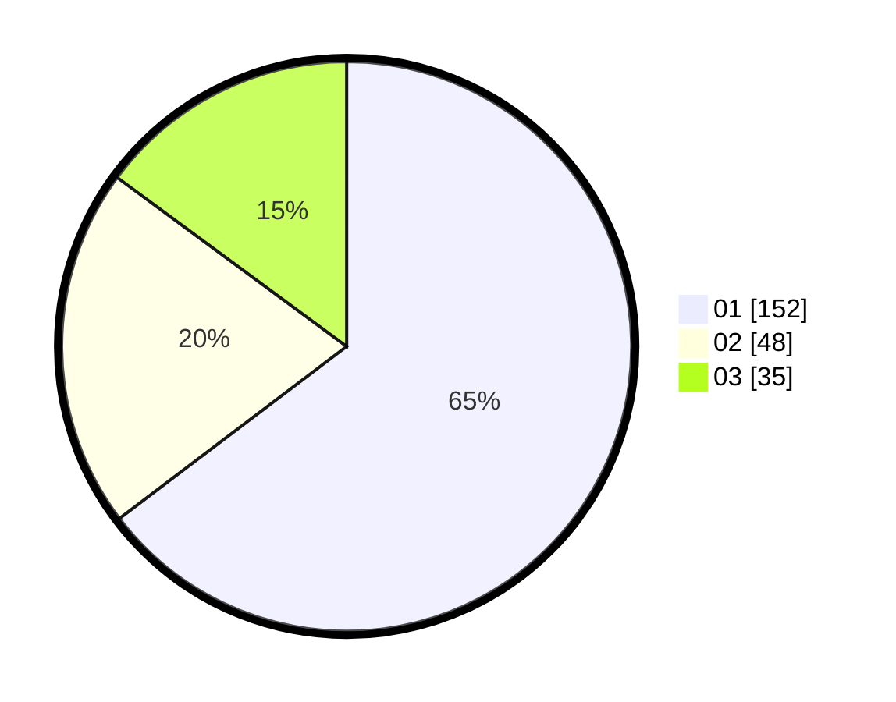

# Hasil

Hasil perolehan suara paslon dapat dilihat pada file paslon-01.txt, paslon-02.txt, dan paslon-03.txt.

Jika tidak ada, artinya data tersebut belum ada pada SIREKAP.

## Perolehan Suara

 * Paslon 01: **152**.
 * Paslon 02: **48**.
 * Paslon 03: **35**.

## Foto C Plano

https://sirekap-obj-formc.kpu.go.id/fe00/pemilu/ppwp/31/75/03/10/02/3175031002024-20240216-143753--07559001-7ef3-4987-9581-b136c336da7c.jpg

https://sirekap-obj-formc.kpu.go.id/fe00/pemilu/ppwp/31/75/03/10/02/3175031002024-20240216-143754--caacc730-0c88-4467-9a2c-56eccf8b187e.jpg

https://sirekap-obj-formc.kpu.go.id/fe00/pemilu/ppwp/31/75/03/10/02/3175031002024-20240216-143754--455c7478-194f-4b55-99b1-a5528c87b155.jpg

## DATA PEMILIH TETAP

Jumlah pemilih dalam DPT: **258**.
 * L: **131**.
 * P: **127**.

## DATA PENGGUNA HAK PILIH

Jumlah pengguna hak pilih dalam DPT: **211**.
 * L: **98**.
 * P: **113**.

Jumlah pengguna hak pilih dalam DPTb: **24**.
 * L: **7**.
 * P: **17**.

Jumlah pengguna hak pilih dalam DPK: **0**.
 * L: **0**.
 * P: **0**.

Jumlah pengguna hak pilih: **235**.
 * L: **105**.
 * P: **130**.

## JUMLAH SUARA SAH DAN TIDAK SAH

JUMLAH SELURUH SUARA SAH: **235**.

JUMLAH SUARA TIDAK SAH: **1**.

JUMLAH SELURUH SUARA SAH DAN SUARA TIDAK SAH: **236**.
