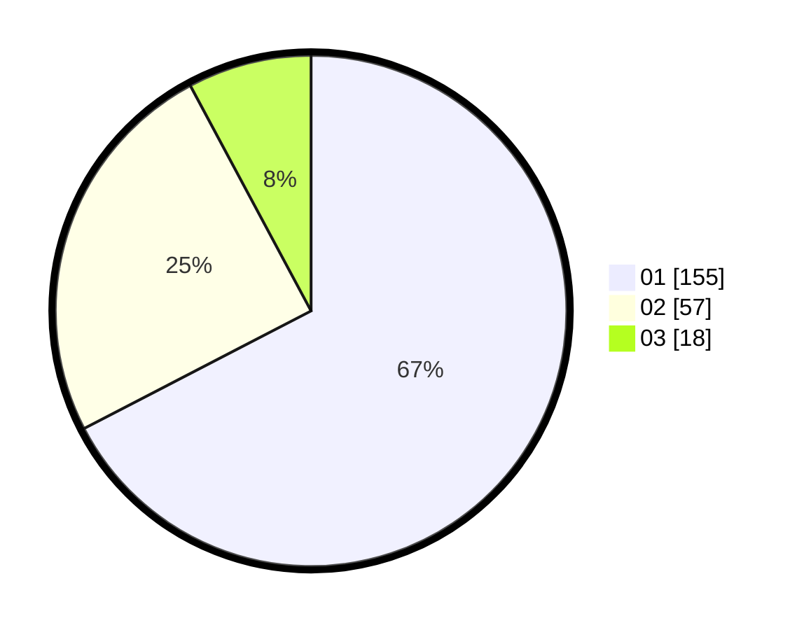

# Hasil

Hasil perolehan suara paslon dapat dilihat pada file paslon-01.txt, paslon-02.txt, dan paslon-03.txt.

Jika tidak ada, artinya data tersebut belum ada pada SIREKAP.

## Perolehan Suara

 * Paslon 01: **155**.
 * Paslon 02: **57**.
 * Paslon 03: **18**.

## Foto C Plano

https://sirekap-obj-formc.kpu.go.id/d3e7/pemilu/ppwp/31/75/03/10/02/3175031002026-20240215-144619--ca34423a-576c-4b37-8ebf-03fc31e1f26f.jpg

https://sirekap-obj-formc.kpu.go.id/d3e7/pemilu/ppwp/31/75/03/10/02/3175031002026-20240215-144640--8e1d2f15-db3e-4389-823d-aeb846a3f85b.jpg

https://sirekap-obj-formc.kpu.go.id/d3e7/pemilu/ppwp/31/75/03/10/02/3175031002026-20240215-144629--28f1ad6e-2377-43fc-a0bb-9bf291328be4.jpg

## DATA PEMILIH TETAP

Jumlah pemilih dalam DPT: **255**.
 * L: **129**.
 * P: **126**.

## DATA PENGGUNA HAK PILIH

Jumlah pengguna hak pilih dalam DPT: **220**.
 * L: **105**.
 * P: **115**.

Jumlah pengguna hak pilih dalam DPTb: **14**.
 * L: **5**.
 * P: **9**.

Jumlah pengguna hak pilih dalam DPK: **1**.
 * L: **0**.
 * P: **1**.

Jumlah pengguna hak pilih: **235**.
 * L: **110**.
 * P: **125**.

## JUMLAH SUARA SAH DAN TIDAK SAH

JUMLAH SELURUH SUARA SAH: **230**.

JUMLAH SUARA TIDAK SAH: **5**.

JUMLAH SELURUH SUARA SAH DAN SUARA TIDAK SAH: **235**.
