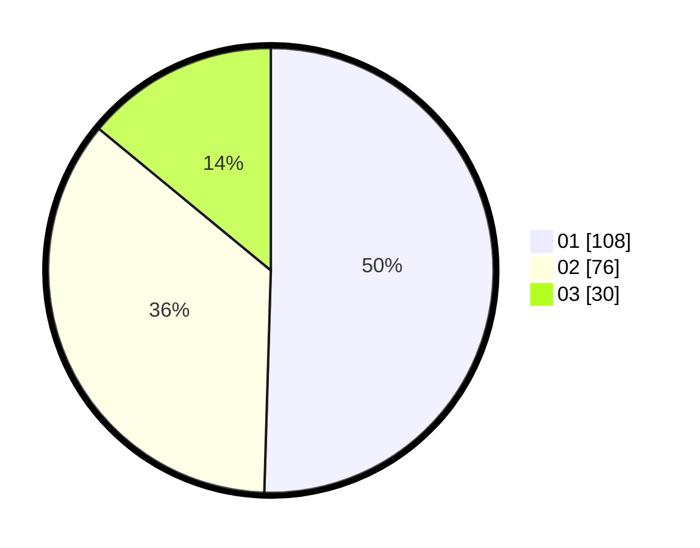

# Hasil

Hasil perolehan suara paslon dapat dilihat pada file paslon-01.txt, paslon-02.txt, dan paslon-03.txt.

Jika tidak ada, artinya data tersebut belum ada pada SIREKAP.

## Perolehan Suara

 * Paslon 01: **108**.
 * Paslon 02: **76**.
 * Paslon 03: **30**.

## Foto C Plano

https://sirekap-obj-formc.kpu.go.id/c902/pemilu/ppwp/31/75/03/10/02/3175031002029-20240215-131933--9e0cda3d-da77-4eee-9d6c-866da6ee8d5e.jpg

https://sirekap-obj-formc.kpu.go.id/c902/pemilu/ppwp/31/75/03/10/02/3175031002029-20240215-131954--0b20bb61-1fe5-429c-9e5f-165af72276f5.jpg

https://sirekap-obj-formc.kpu.go.id/c902/pemilu/ppwp/31/75/03/10/02/3175031002029-20240215-131943--37339dcb-23e4-4cf6-be08-3ebebe4a468f.jpg

## DATA PEMILIH TETAP

Jumlah pemilih dalam DPT: **261**.
 * L: **125**.
 * P: **136**.

## DATA PENGGUNA HAK PILIH

Jumlah pengguna hak pilih dalam DPT: **199**.
 * L: **93**.
 * P: **106**.

Jumlah pengguna hak pilih dalam DPTb: **16**.
 * L: **4**.
 * P: **12**.

Jumlah pengguna hak pilih dalam DPK: **0**.
 * L: **0**.
 * P: **0**.

Jumlah pengguna hak pilih: **215**.
 * L: **97**.
 * P: **118**.

## JUMLAH SUARA SAH DAN TIDAK SAH

JUMLAH SELURUH SUARA SAH: **214**.

JUMLAH SUARA TIDAK SAH: **1**.

JUMLAH SELURUH SUARA SAH DAN SUARA TIDAK SAH: **215**.
