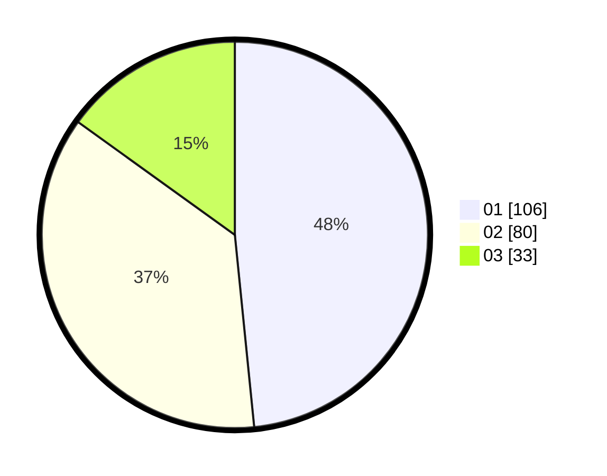

# Hasil

Hasil perolehan suara paslon dapat dilihat pada file paslon-01.txt, paslon-02.txt, dan paslon-03.txt.

Jika tidak ada, artinya data tersebut belum ada pada SIREKAP.

## Perolehan Suara

 * Paslon 01: **106**.
 * Paslon 02: **80**.
 * Paslon 03: **33**.

## Foto C Plano

https://sirekap-obj-formc.kpu.go.id/5922/pemilu/ppwp/31/75/03/10/02/3175031002030-20240214-233416--30011232-8363-419f-89e4-1c7e23735fa0.jpg

https://sirekap-obj-formc.kpu.go.id/5922/pemilu/ppwp/31/75/03/10/02/3175031002030-20240214-233908--b0c29945-3864-4a5d-8e60-4e6b6100520d.jpg

https://sirekap-obj-formc.kpu.go.id/5922/pemilu/ppwp/31/75/03/10/02/3175031002030-20240214-234105--e4a4cf24-c21e-41ef-8e6e-e6b540dbbbea.jpg
