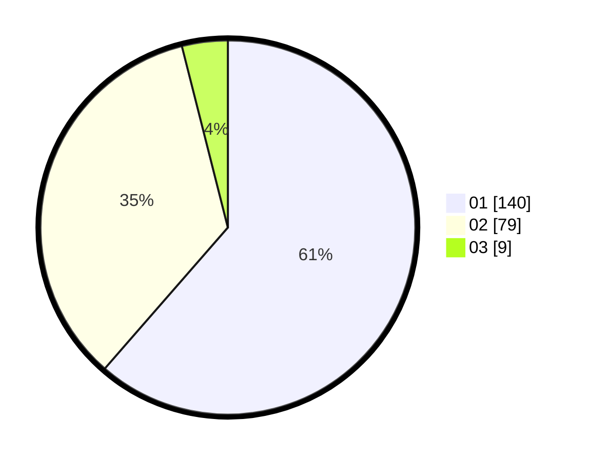

# Hasil

Hasil perolehan suara paslon dapat dilihat pada file paslon-01.txt, paslon-02.txt, dan paslon-03.txt.

Jika tidak ada, artinya data tersebut belum ada pada SIREKAP.

## Perolehan Suara

 * Paslon 01: **140**.
 * Paslon 02: **79**.
 * Paslon 03: **9**.

## Foto C Plano

https://sirekap-obj-formc.kpu.go.id/c63d/pemilu/ppwp/31/75/03/10/02/3175031002032-20240214-205245--5b5db344-1206-4b79-8ea6-ad49bf2ab7fc.jpg

https://sirekap-obj-formc.kpu.go.id/c63d/pemilu/ppwp/31/75/03/10/02/3175031002032-20240214-205311--daa1fc27-6dd9-4db0-90a5-afff4ee38feb.jpg

https://sirekap-obj-formc.kpu.go.id/c63d/pemilu/ppwp/31/75/03/10/02/3175031002032-20240214-205337--34116379-1343-432e-875f-7cacc0b5bc7c.jpg

## DATA PEMILIH TETAP

Jumlah pemilih dalam DPT: **266**.
 * L: **133**.
 * P: **133**.

## DATA PENGGUNA HAK PILIH

Jumlah pengguna hak pilih dalam DPT: **207**.
 * L: **98**.
 * P: **109**.

Jumlah pengguna hak pilih dalam DPTb: **18**.
 * L: **9**.
 * P: **9**.

Jumlah pengguna hak pilih dalam DPK: **3**.
 * L: **2**.
 * P: **1**.

Jumlah pengguna hak pilih: **228**.
 * L: **109**.
 * P: **119**.

## JUMLAH SUARA SAH DAN TIDAK SAH

JUMLAH SELURUH SUARA SAH: **228**.

JUMLAH SUARA TIDAK SAH: **0**.

JUMLAH SELURUH SUARA SAH DAN SUARA TIDAK SAH: **228**.
