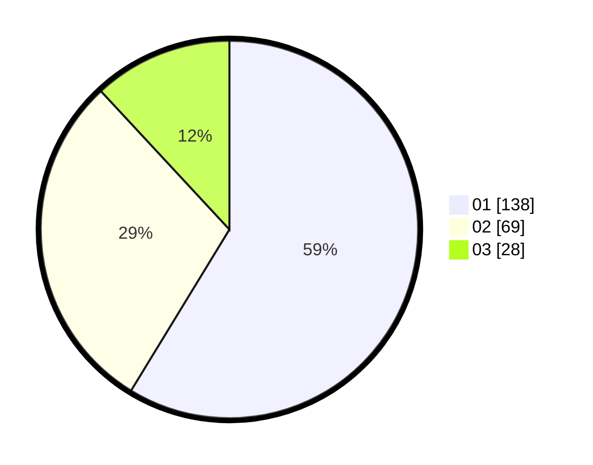

# Hasil

Hasil perolehan suara paslon dapat dilihat pada file paslon-01.txt, paslon-02.txt, dan paslon-03.txt.

Jika tidak ada, artinya data tersebut belum ada pada SIREKAP.

## Perolehan Suara

 * Paslon 01: **138**.
 * Paslon 02: **69**.
 * Paslon 03: **28**.

## Foto C Plano

https://sirekap-obj-formc.kpu.go.id/101d/pemilu/ppwp/31/75/03/10/02/3175031002036-20240214-234832--f017ea51-1e1e-4726-bae4-c0b9273d35ae.jpg

https://sirekap-obj-formc.kpu.go.id/101d/pemilu/ppwp/31/75/03/10/02/3175031002036-20240214-235140--f9d977ca-c5e0-4e59-91e0-f9b51fef00a1.jpg

https://sirekap-obj-formc.kpu.go.id/101d/pemilu/ppwp/31/75/03/10/02/3175031002036-20240214-235509--0d3e1b3e-db5d-488e-b33f-ebd9cffac705.jpg
