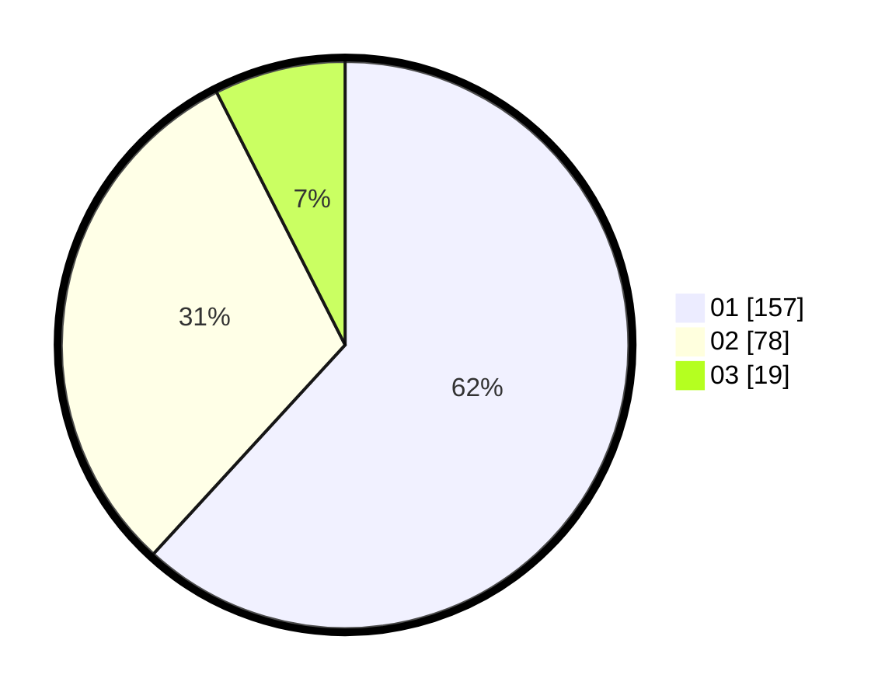

# Hasil

Hasil perolehan suara paslon dapat dilihat pada file paslon-01.txt, paslon-02.txt, dan paslon-03.txt.

Jika tidak ada, artinya data tersebut belum ada pada SIREKAP.

## Perolehan Suara

 * Paslon 01: **157**.
 * Paslon 02: **78**.
 * Paslon 03: **19**.

## Foto C Plano

https://sirekap-obj-formc.kpu.go.id/39eb/pemilu/ppwp/31/75/03/10/02/3175031002038-20240214-160114--5659b7bc-5d35-48e3-89e1-4f58f9b76f93.jpg

https://sirekap-obj-formc.kpu.go.id/39eb/pemilu/ppwp/31/75/03/10/02/3175031002038-20240214-155426--4a440413-f7de-4115-8037-8e98e00a47a9.jpg

https://sirekap-obj-formc.kpu.go.id/39eb/pemilu/ppwp/31/75/03/10/02/3175031002038-20240214-155455--3904a15e-77bf-49e6-9b3d-ff261307b827.jpg

## DATA PEMILIH TETAP

Jumlah pemilih dalam DPT: **287**.
 * L: **142**.
 * P: **145**.

## DATA PENGGUNA HAK PILIH

Jumlah pengguna hak pilih dalam DPT: **244**.
 * L: **115**.
 * P: **129**.

Jumlah pengguna hak pilih dalam DPTb: **14**.
 * L: **3**.
 * P: **11**.

Jumlah pengguna hak pilih dalam DPK: **0**.
 * L: **0**.
 * P: **0**.

Jumlah pengguna hak pilih: **258**.
 * L: **118**.
 * P: **140**.

## JUMLAH SUARA SAH DAN TIDAK SAH

JUMLAH SELURUH SUARA SAH: **254**.

JUMLAH SUARA TIDAK SAH: **4**.

JUMLAH SELURUH SUARA SAH DAN SUARA TIDAK SAH: **258**.
