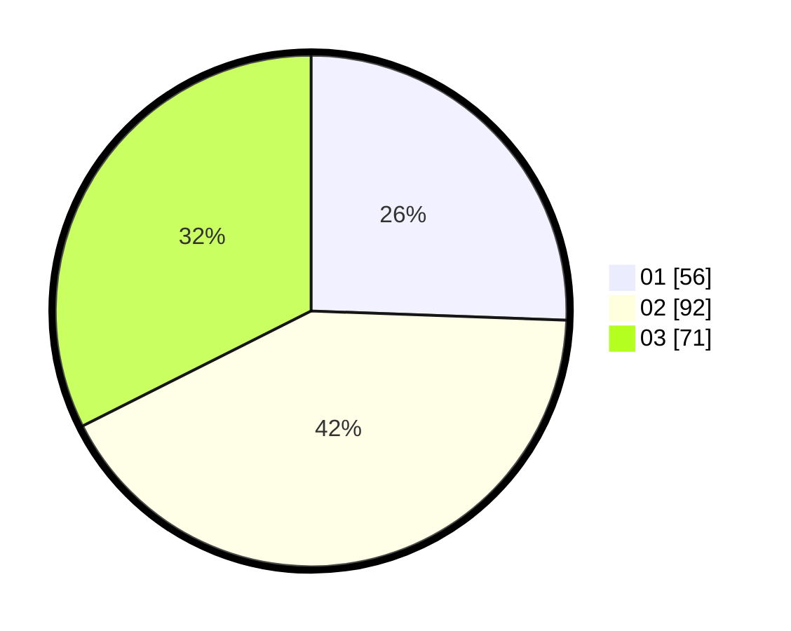

# Hasil

Hasil perolehan suara paslon dapat dilihat pada file paslon-01.txt, paslon-02.txt, dan paslon-03.txt.

Jika tidak ada, artinya data tersebut belum ada pada SIREKAP.

## Perolehan Suara

 * Paslon 01: **56**.
 * Paslon 02: **92**.
 * Paslon 03: **71**.

## Foto C Plano

https://sirekap-obj-formc.kpu.go.id/9e3a/pemilu/ppwp/31/75/03/10/02/3175031002041-20240214-230143--ecdb9a86-2db9-43fe-982b-625872afefd9.jpg

https://sirekap-obj-formc.kpu.go.id/9e3a/pemilu/ppwp/31/75/03/10/02/3175031002041-20240214-230250--b91406c1-df34-4696-bbf3-23d2f9b73e4e.jpg

https://sirekap-obj-formc.kpu.go.id/9e3a/pemilu/ppwp/31/75/03/10/02/3175031002041-20240214-230347--a7b1b684-c79f-4429-898d-cad8afc579b8.jpg
