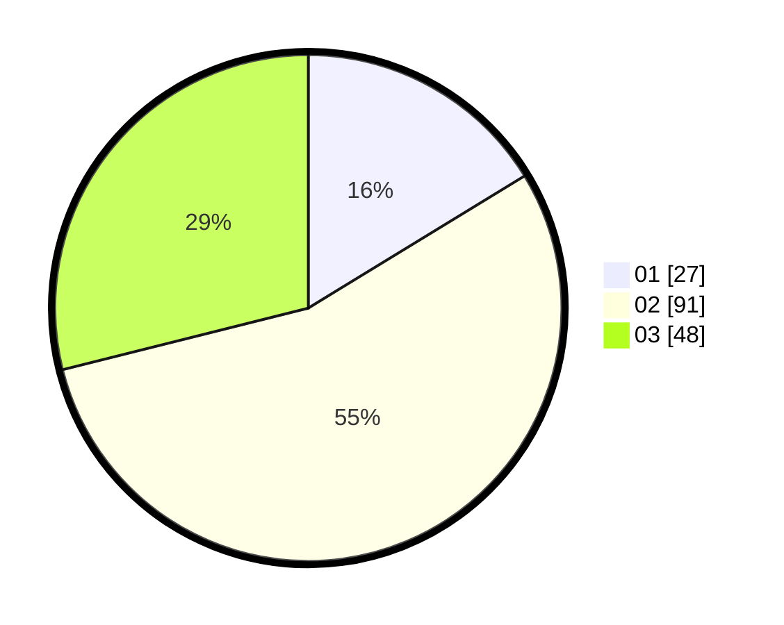

# Hasil

Hasil perolehan suara paslon dapat dilihat pada file paslon-01.txt, paslon-02.txt, dan paslon-03.txt.

Jika tidak ada, artinya data tersebut belum ada pada SIREKAP.

## Perolehan Suara

 * Paslon 01: **27**.
 * Paslon 02: **91**.
 * Paslon 03: **48**.

## Foto C Plano

https://sirekap-obj-formc.kpu.go.id/aaa2/pemilu/ppwp/31/75/03/10/02/3175031002047-20240214-155251--96eadbc5-b61b-4fb1-a57f-2c62442b3757.jpg

https://sirekap-obj-formc.kpu.go.id/aaa2/pemilu/ppwp/31/75/03/10/02/3175031002047-20240214-155140--82d92379-d57c-4366-90d2-7261aea60b96.jpg

https://sirekap-obj-formc.kpu.go.id/aaa2/pemilu/ppwp/31/75/03/10/02/3175031002047-20240214-155832--42a46e71-bbab-4162-aefd-637fa3d39635.jpg

## DATA PEMILIH TETAP

Jumlah pemilih dalam DPT: **283**.
 * L: **135**.
 * P: **148**.

## DATA PENGGUNA HAK PILIH

Jumlah pengguna hak pilih dalam DPT: **162**.
 * L: **73**.
 * P: **89**.

Jumlah pengguna hak pilih dalam DPTb: **1**.
 * L: **1**.
 * P: **0**.

Jumlah pengguna hak pilih dalam DPK: **6**.
 * L: **2**.
 * P: **4**.

Jumlah pengguna hak pilih: **169**.
 * L: **76**.
 * P: **93**.

## JUMLAH SUARA SAH DAN TIDAK SAH

JUMLAH SELURUH SUARA SAH: **166**.

JUMLAH SUARA TIDAK SAH: **3**.

JUMLAH SELURUH SUARA SAH DAN SUARA TIDAK SAH: **169**.
