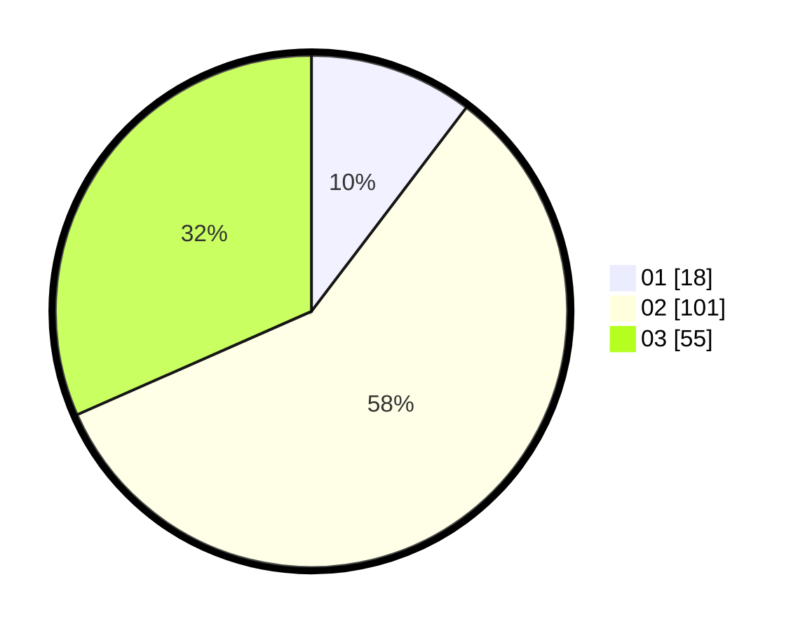

# Hasil

Hasil perolehan suara paslon dapat dilihat pada file paslon-01.txt, paslon-02.txt, dan paslon-03.txt.

Jika tidak ada, artinya data tersebut belum ada pada SIREKAP.

## Perolehan Suara

 * Paslon 01: **18**.
 * Paslon 02: **101**.
 * Paslon 03: **55**.

## Foto C Plano

https://sirekap-obj-formc.kpu.go.id/4010/pemilu/ppwp/31/75/03/10/02/3175031002048-20240214-231909--386a2c1a-aa66-40a5-a5cb-065b850fbaf6.jpg

https://sirekap-obj-formc.kpu.go.id/4010/pemilu/ppwp/31/75/03/10/02/3175031002048-20240214-233709--a02be667-a517-403e-a96d-6055aeb2b1c3.jpg

https://sirekap-obj-formc.kpu.go.id/4010/pemilu/ppwp/31/75/03/10/02/3175031002048-20240214-232957--7d7b796c-1ab3-4fce-aead-2fd3ed1194e9.jpg
