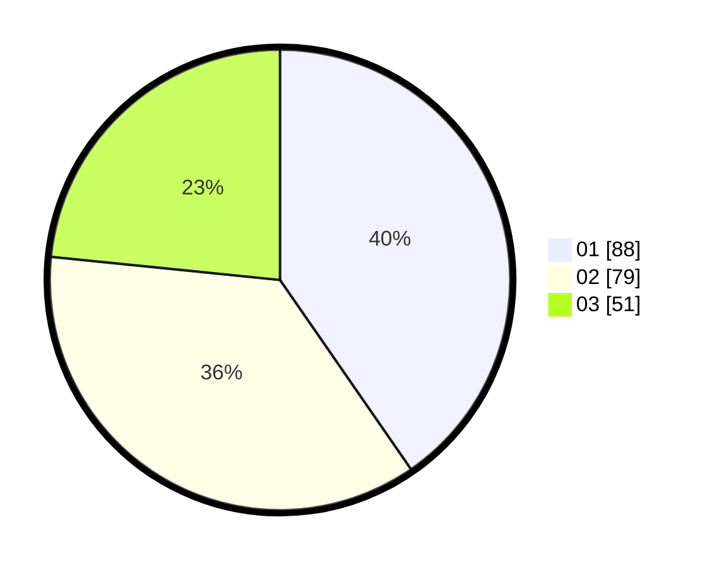

# Hasil

Hasil perolehan suara paslon dapat dilihat pada file paslon-01.txt, paslon-02.txt, dan paslon-03.txt.

Jika tidak ada, artinya data tersebut belum ada pada SIREKAP.

## Perolehan Suara

 * Paslon 01: **88**.
 * Paslon 02: **79**.
 * Paslon 03: **51**.

## Foto C Plano

https://sirekap-obj-formc.kpu.go.id/a24d/pemilu/ppwp/31/75/03/10/02/3175031002050-20240214-230902--67e819a3-11fd-476b-a12d-d88c23142d58.jpg

https://sirekap-obj-formc.kpu.go.id/a24d/pemilu/ppwp/31/75/03/10/02/3175031002050-20240214-231132--55cb52e8-8b1a-4353-9765-3995480115bc.jpg

https://sirekap-obj-formc.kpu.go.id/a24d/pemilu/ppwp/31/75/03/10/02/3175031002050-20240214-231453--e41413ba-177f-4905-aebb-6047fb78bfd5.jpg
