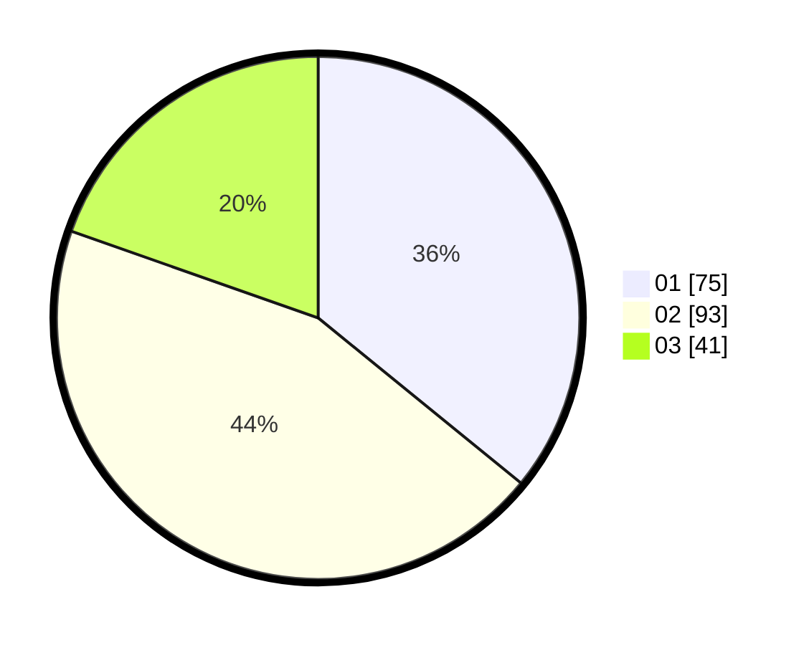

# Hasil

Hasil perolehan suara paslon dapat dilihat pada file paslon-01.txt, paslon-02.txt, dan paslon-03.txt.

Jika tidak ada, artinya data tersebut belum ada pada SIREKAP.

## Perolehan Suara

 * Paslon 01: **75**.
 * Paslon 02: **93**.
 * Paslon 03: **41**.

## Foto C Plano

https://sirekap-obj-formc.kpu.go.id/4ea0/pemilu/ppwp/31/75/03/10/02/3175031002052-20240214-231113--2b11962d-b4fc-4014-88c5-86f34b1f40fd.jpg

https://sirekap-obj-formc.kpu.go.id/4ea0/pemilu/ppwp/31/75/03/10/02/3175031002052-20240214-231132--b0d4f48a-24bd-42f1-a121-e581542e898a.jpg

https://sirekap-obj-formc.kpu.go.id/4ea0/pemilu/ppwp/31/75/03/10/02/3175031002052-20240214-231152--a4e88966-733a-4fee-bc1b-0fca6461a2c6.jpg
