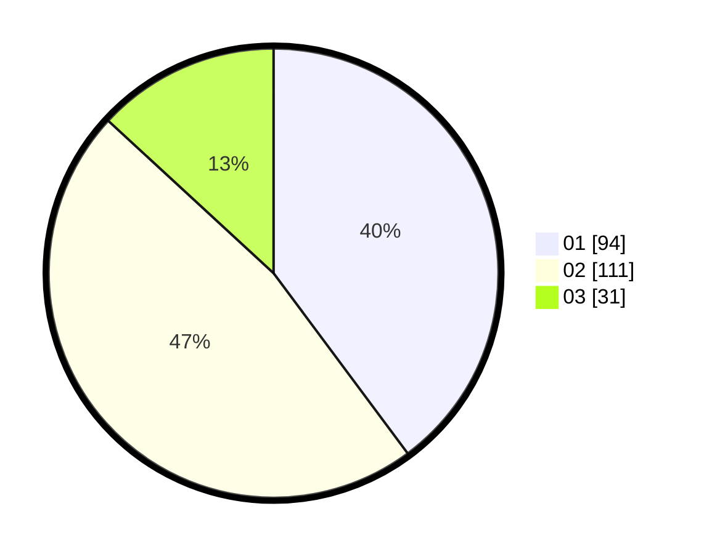

# Hasil

Hasil perolehan suara paslon dapat dilihat pada file paslon-01.txt, paslon-02.txt, dan paslon-03.txt.

Jika tidak ada, artinya data tersebut belum ada pada SIREKAP.

## Perolehan Suara

 * Paslon 01: **94**.
 * Paslon 02: **111**.
 * Paslon 03: **31**.

## Foto C Plano

https://sirekap-obj-formc.kpu.go.id/8ff8/pemilu/ppwp/31/75/03/10/02/3175031002055-20240216-003313--76fa5acc-9846-4ded-8aa8-ea6cc34d80ef.jpg

https://sirekap-obj-formc.kpu.go.id/8ff8/pemilu/ppwp/31/75/03/10/02/3175031002055-20240216-003315--f3aa5713-6d75-4890-969d-677a92cbbcfb.jpg

https://sirekap-obj-formc.kpu.go.id/8ff8/pemilu/ppwp/31/75/03/10/02/3175031002055-20240216-003314--e57ee75c-e097-49ba-8343-78533d6f9358.jpg

## DATA PEMILIH TETAP

Jumlah pemilih dalam DPT: **271**.
 * L: **139**.
 * P: **132**.

## DATA PENGGUNA HAK PILIH

Jumlah pengguna hak pilih dalam DPT: **219**.
 * L: **106**.
 * P: **113**.

Jumlah pengguna hak pilih dalam DPTb: **15**.
 * L: **7**.
 * P: **8**.

Jumlah pengguna hak pilih dalam DPK: **5**.
 * L: **1**.
 * P: **4**.

Jumlah pengguna hak pilih: **239**.
 * L: **114**.
 * P: **125**.

## JUMLAH SUARA SAH DAN TIDAK SAH

JUMLAH SELURUH SUARA SAH: **236**.

JUMLAH SUARA TIDAK SAH: **3**.

JUMLAH SELURUH SUARA SAH DAN SUARA TIDAK SAH: **239**.
