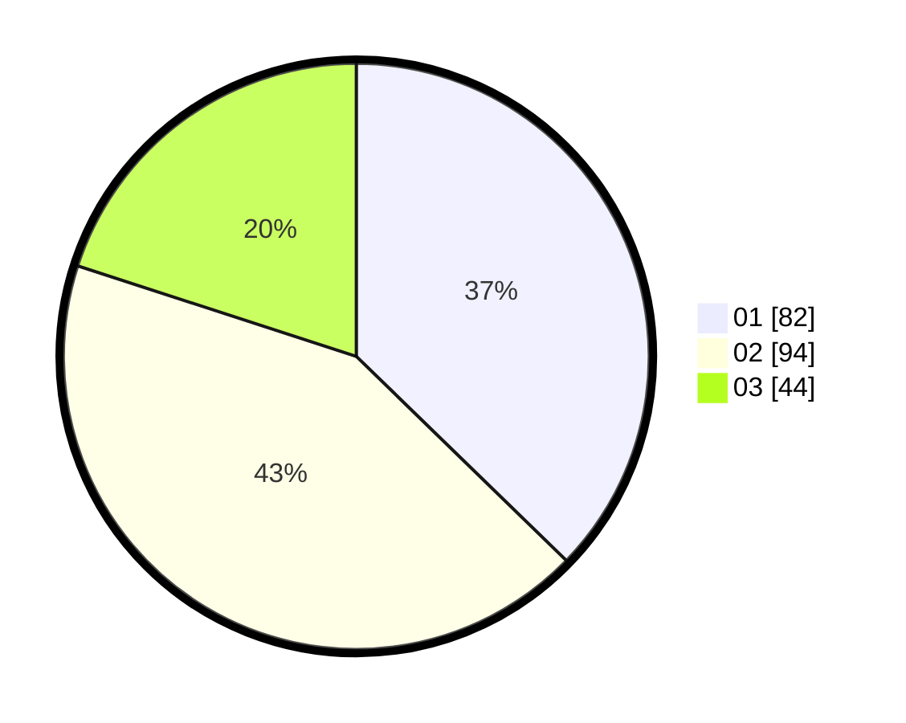

# Hasil

Hasil perolehan suara paslon dapat dilihat pada file paslon-01.txt, paslon-02.txt, dan paslon-03.txt.

Jika tidak ada, artinya data tersebut belum ada pada SIREKAP.

## Perolehan Suara

 * Paslon 01: **82**.
 * Paslon 02: **94**.
 * Paslon 03: **44**.

## Foto C Plano

https://sirekap-obj-formc.kpu.go.id/ac2d/pemilu/ppwp/31/75/03/10/02/3175031002056-20240214-155234--346b8c67-5afd-4261-b55c-7592e7128b5c.jpg

https://sirekap-obj-formc.kpu.go.id/ac2d/pemilu/ppwp/31/75/03/10/02/3175031002056-20240214-155312--996ea366-8230-40b9-b066-c9756e7619b5.jpg

https://sirekap-obj-formc.kpu.go.id/ac2d/pemilu/ppwp/31/75/03/10/02/3175031002056-20240214-155354--f263ced8-4746-43a2-a95c-abc533ee0a30.jpg

## DATA PEMILIH TETAP

Jumlah pemilih dalam DPT: **271**.
 * L: **150**.
 * P: **121**.

## DATA PENGGUNA HAK PILIH

Jumlah pengguna hak pilih dalam DPT: **206**.
 * L: **109**.
 * P: **97**.

Jumlah pengguna hak pilih dalam DPTb: **16**.
 * L: **13**.
 * P: **3**.

Jumlah pengguna hak pilih dalam DPK: **0**.
 * L: **0**.
 * P: **0**.

Jumlah pengguna hak pilih: **222**.
 * L: **122**.
 * P: **100**.

## JUMLAH SUARA SAH DAN TIDAK SAH

JUMLAH SELURUH SUARA SAH: **220**.

JUMLAH SUARA TIDAK SAH: **2**.

JUMLAH SELURUH SUARA SAH DAN SUARA TIDAK SAH: **222**.
