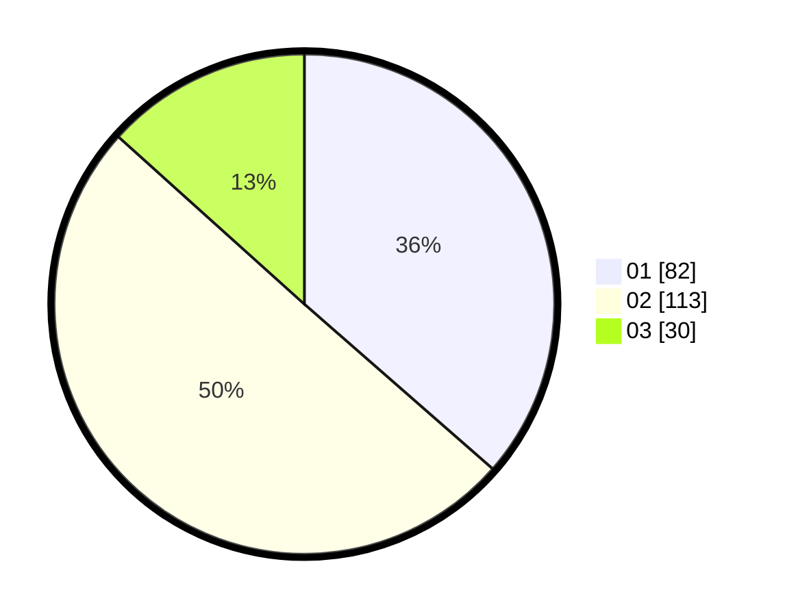

# Hasil

Hasil perolehan suara paslon dapat dilihat pada file paslon-01.txt, paslon-02.txt, dan paslon-03.txt.

Jika tidak ada, artinya data tersebut belum ada pada SIREKAP.

## Perolehan Suara

 * Paslon 01: **82**.
 * Paslon 02: **113**.
 * Paslon 03: **30**.

## Foto C Plano

https://sirekap-obj-formc.kpu.go.id/e2c6/pemilu/ppwp/31/75/03/10/02/3175031002057-20240214-223048--4874f53d-6e1f-40d3-9a06-b7087977498b.jpg

https://sirekap-obj-formc.kpu.go.id/e2c6/pemilu/ppwp/31/75/03/10/02/3175031002057-20240214-225552--54aabbf9-19dd-4f31-856e-689b60ae6ea7.jpg

https://sirekap-obj-formc.kpu.go.id/e2c6/pemilu/ppwp/31/75/03/10/02/3175031002057-20240214-223302--df14330f-08df-41ed-9e87-77d522a50d4f.jpg
