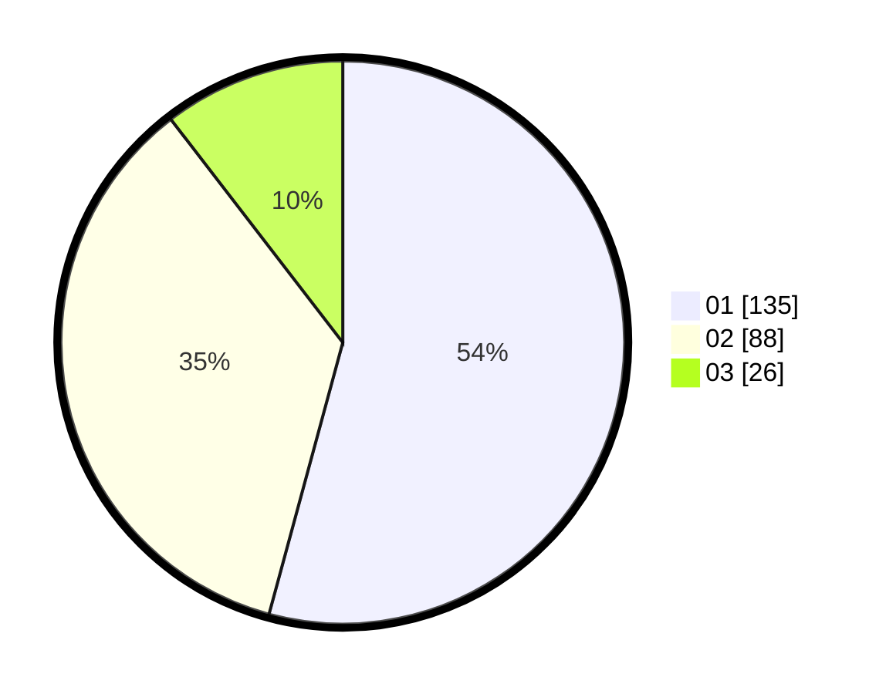

# Hasil

Hasil perolehan suara paslon dapat dilihat pada file paslon-01.txt, paslon-02.txt, dan paslon-03.txt.

Jika tidak ada, artinya data tersebut belum ada pada SIREKAP.

## Perolehan Suara

 * Paslon 01: **135**.
 * Paslon 02: **88**.
 * Paslon 03: **26**.

## Foto C Plano

https://sirekap-obj-formc.kpu.go.id/a9a8/pemilu/ppwp/31/75/03/10/02/3175031002061-20240214-230344--f9d1b306-8039-4a77-b14f-66db4598a03f.jpg

https://sirekap-obj-formc.kpu.go.id/a9a8/pemilu/ppwp/31/75/03/10/02/3175031002061-20240214-230601--5ad2de75-58b2-437e-b298-797346753cbe.jpg

https://sirekap-obj-formc.kpu.go.id/a9a8/pemilu/ppwp/31/75/03/10/02/3175031002061-20240214-230705--f99f6785-e2a3-4c24-a860-82736cac1f88.jpg
