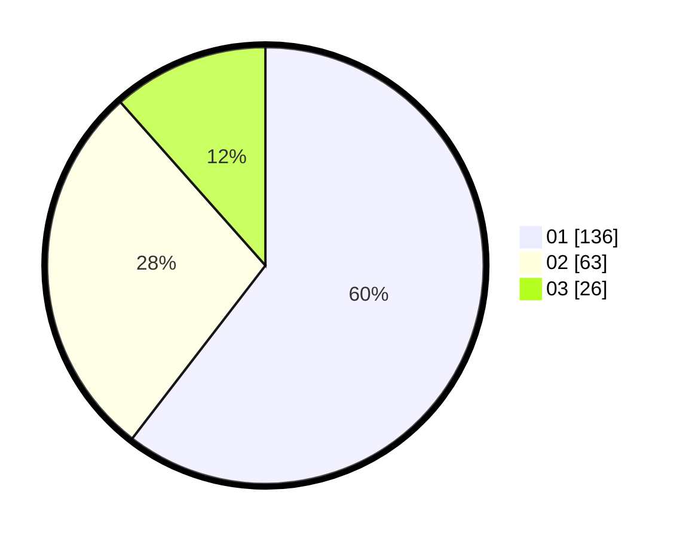

# Hasil

Hasil perolehan suara paslon dapat dilihat pada file paslon-01.txt, paslon-02.txt, dan paslon-03.txt.

Jika tidak ada, artinya data tersebut belum ada pada SIREKAP.

## Perolehan Suara

 * Paslon 01: **136**.
 * Paslon 02: **63**.
 * Paslon 03: **26**.

## Foto C Plano

https://sirekap-obj-formc.kpu.go.id/ba01/pemilu/ppwp/31/75/03/10/02/3175031002066-20240215-010501--7a780b6d-191d-4b22-8721-fb2b8c3f47e7.jpg

https://sirekap-obj-formc.kpu.go.id/ba01/pemilu/ppwp/31/75/03/10/02/3175031002066-20240215-010936--e75ac23d-9711-4d3e-8af0-35470673fb71.jpg

https://sirekap-obj-formc.kpu.go.id/ba01/pemilu/ppwp/31/75/03/10/02/3175031002066-20240215-011304--034cdcc5-9429-49b0-bc9b-bbe7c7618ecd.jpg

## DATA PEMILIH TETAP

Jumlah pemilih dalam DPT: **276**.
 * L: **132**.
 * P: **144**.

## DATA PENGGUNA HAK PILIH

Jumlah pengguna hak pilih dalam DPT: **227**.
 * L: **101**.
 * P: **126**.

Jumlah pengguna hak pilih dalam DPTb: **0**.
 * L: **0**.
 * P: **0**.

Jumlah pengguna hak pilih dalam DPK: **0**.
 * L: **0**.
 * P: **0**.

Jumlah pengguna hak pilih: **227**.
 * L: **101**.
 * P: **126**.

## JUMLAH SUARA SAH DAN TIDAK SAH

JUMLAH SELURUH SUARA SAH: **225**.

JUMLAH SUARA TIDAK SAH: **2**.

JUMLAH SELURUH SUARA SAH DAN SUARA TIDAK SAH: **227**.
