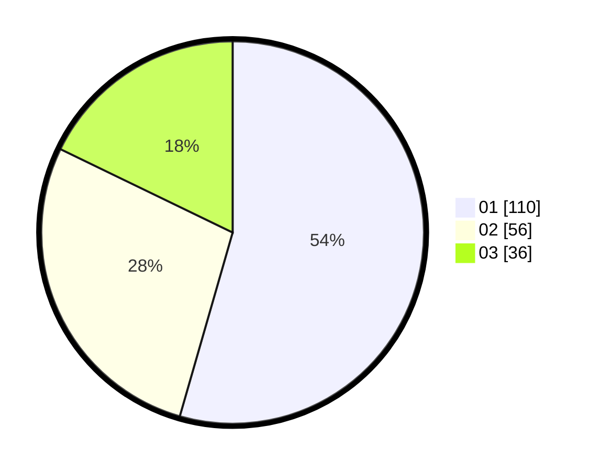

# Hasil

Hasil perolehan suara paslon dapat dilihat pada file paslon-01.txt, paslon-02.txt, dan paslon-03.txt.

Jika tidak ada, artinya data tersebut belum ada pada SIREKAP.

## Perolehan Suara

 * Paslon 01: **110**.
 * Paslon 02: **56**.
 * Paslon 03: **36**.

## Foto C Plano

https://sirekap-obj-formc.kpu.go.id/33c4/pemilu/ppwp/31/75/03/10/02/3175031002068-20240215-013850--b3cf732c-4eb1-4f1c-9887-5c203daeb23e.jpg

https://sirekap-obj-formc.kpu.go.id/33c4/pemilu/ppwp/31/75/03/10/02/3175031002068-20240215-014008--73067a3a-ff04-42c9-8512-472e042bd6c9.jpg

https://sirekap-obj-formc.kpu.go.id/33c4/pemilu/ppwp/31/75/03/10/02/3175031002068-20240215-014113--e0a618ef-d0e0-4593-89be-520fcb9c97d5.jpg
