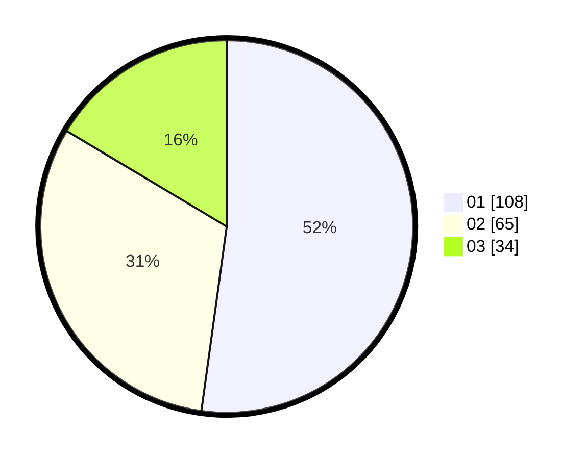

# Hasil

Hasil perolehan suara paslon dapat dilihat pada file paslon-01.txt, paslon-02.txt, dan paslon-03.txt.

Jika tidak ada, artinya data tersebut belum ada pada SIREKAP.

## Perolehan Suara

 * Paslon 01: **108**.
 * Paslon 02: **65**.
 * Paslon 03: **34**.

## Foto C Plano

https://sirekap-obj-formc.kpu.go.id/3c89/pemilu/ppwp/31/75/03/10/02/3175031002070-20240216-001336--ed49686c-c9d4-4559-8898-21ed0922801a.jpg

https://sirekap-obj-formc.kpu.go.id/3c89/pemilu/ppwp/31/75/03/10/02/3175031002070-20240215-024435--954fa0a9-fcbc-44c8-a0ab-a54660433b54.jpg

https://sirekap-obj-formc.kpu.go.id/3c89/pemilu/ppwp/31/75/03/10/02/3175031002070-20240215-003008--a5a8743e-e71e-4409-8da3-94ae17a894a6.jpg

## DATA PEMILIH TETAP

Jumlah pemilih dalam DPT: **276**.
 * L: **137**.
 * P: **139**.

## DATA PENGGUNA HAK PILIH

Jumlah pengguna hak pilih dalam DPT: **209**.
 * L: **101**.
 * P: **108**.

Jumlah pengguna hak pilih dalam DPTb: **0**.
 * L: **0**.
 * P: **0**.

Jumlah pengguna hak pilih dalam DPK: **0**.
 * L: **0**.
 * P: **0**.

Jumlah pengguna hak pilih: **209**.
 * L: **101**.
 * P: **108**.

## JUMLAH SUARA SAH DAN TIDAK SAH

JUMLAH SELURUH SUARA SAH: **207**.

JUMLAH SUARA TIDAK SAH: **2**.

JUMLAH SELURUH SUARA SAH DAN SUARA TIDAK SAH: **209**.
