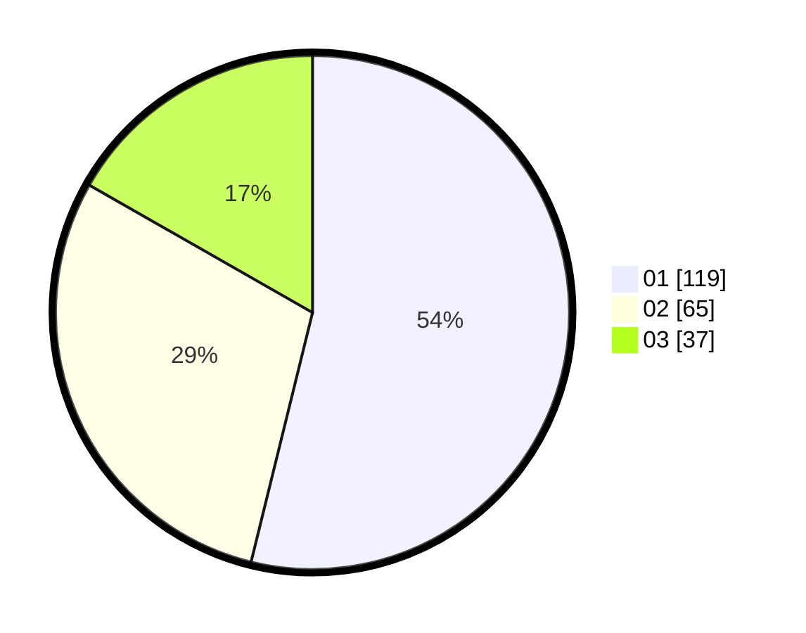

# Hasil

Hasil perolehan suara paslon dapat dilihat pada file paslon-01.txt, paslon-02.txt, dan paslon-03.txt.

Jika tidak ada, artinya data tersebut belum ada pada SIREKAP.

## Perolehan Suara

 * Paslon 01: **119**.
 * Paslon 02: **65**.
 * Paslon 03: **37**.

## Foto C Plano

https://sirekap-obj-formc.kpu.go.id/4a26/pemilu/ppwp/31/75/03/10/02/3175031002071-20240215-212547--040a8878-d17c-404c-bf8d-5fb6a2f770db.jpg

https://sirekap-obj-formc.kpu.go.id/4a26/pemilu/ppwp/31/75/03/10/02/3175031002071-20240215-212549--4e490195-1714-439d-897a-ad1749fcfdf4.jpg

https://sirekap-obj-formc.kpu.go.id/4a26/pemilu/ppwp/31/75/03/10/02/3175031002071-20240215-212548--fa86338b-5b29-4ce5-857c-8db3ee172e95.jpg

## DATA PEMILIH TETAP

Jumlah pemilih dalam DPT: **274**.
 * L: **135**.
 * P: **139**.

## DATA PENGGUNA HAK PILIH

Jumlah pengguna hak pilih dalam DPT: **220**.
 * L: **101**.
 * P: **119**.

Jumlah pengguna hak pilih dalam DPTb: **1**.
 * L: **1**.
 * P: **0**.

Jumlah pengguna hak pilih dalam DPK: **2**.
 * L: **2**.
 * P: **0**.

Jumlah pengguna hak pilih: **223**.
 * L: **104**.
 * P: **119**.

## JUMLAH SUARA SAH DAN TIDAK SAH

JUMLAH SELURUH SUARA SAH: **221**.

JUMLAH SUARA TIDAK SAH: **2**.

JUMLAH SELURUH SUARA SAH DAN SUARA TIDAK SAH: **223**.
