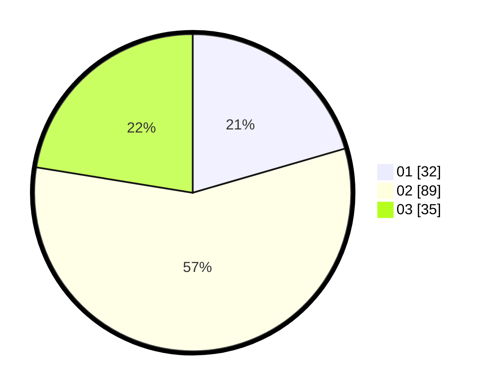

# Hasil

Hasil perolehan suara paslon dapat dilihat pada file paslon-01.txt, paslon-02.txt, dan paslon-03.txt.

Jika tidak ada, artinya data tersebut belum ada pada SIREKAP.

## Perolehan Suara

 * Paslon 01: **32**.
 * Paslon 02: **89**.
 * Paslon 03: **35**.

## Foto C Plano

https://sirekap-obj-formc.kpu.go.id/abe0/pemilu/ppwp/31/75/03/10/02/3175031002077-20240215-003551--a585c3ef-29a9-4c6e-8bdb-795e6cce0d31.jpg

https://sirekap-obj-formc.kpu.go.id/abe0/pemilu/ppwp/31/75/03/10/02/3175031002077-20240215-003558--2189a5d3-c9ac-41f4-b981-659a30b2ce1f.jpg

https://sirekap-obj-formc.kpu.go.id/abe0/pemilu/ppwp/31/75/03/10/02/3175031002077-20240215-003603--8a8b84cd-25fc-498e-ac6b-251535fb6bd0.jpg
