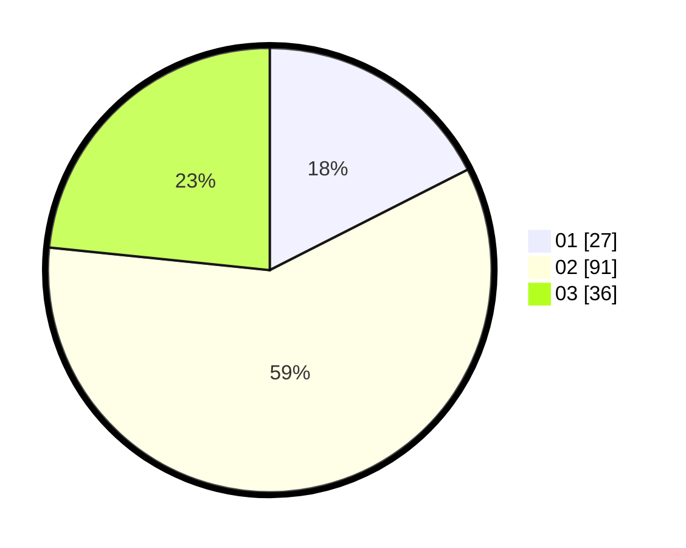

# Hasil

Hasil perolehan suara paslon dapat dilihat pada file paslon-01.txt, paslon-02.txt, dan paslon-03.txt.

Jika tidak ada, artinya data tersebut belum ada pada SIREKAP.

## Perolehan Suara

 * Paslon 01: **27**.
 * Paslon 02: **91**.
 * Paslon 03: **36**.

## Foto C Plano

https://sirekap-obj-formc.kpu.go.id/f1b1/pemilu/ppwp/31/75/03/10/02/3175031002078-20240215-005828--ad6aa1bb-af6e-40bc-86b5-cc09a45d0039.jpg

https://sirekap-obj-formc.kpu.go.id/f1b1/pemilu/ppwp/31/75/03/10/02/3175031002078-20240215-010028--5c903b80-8d54-4c8f-8373-e93c1cc49d55.jpg
