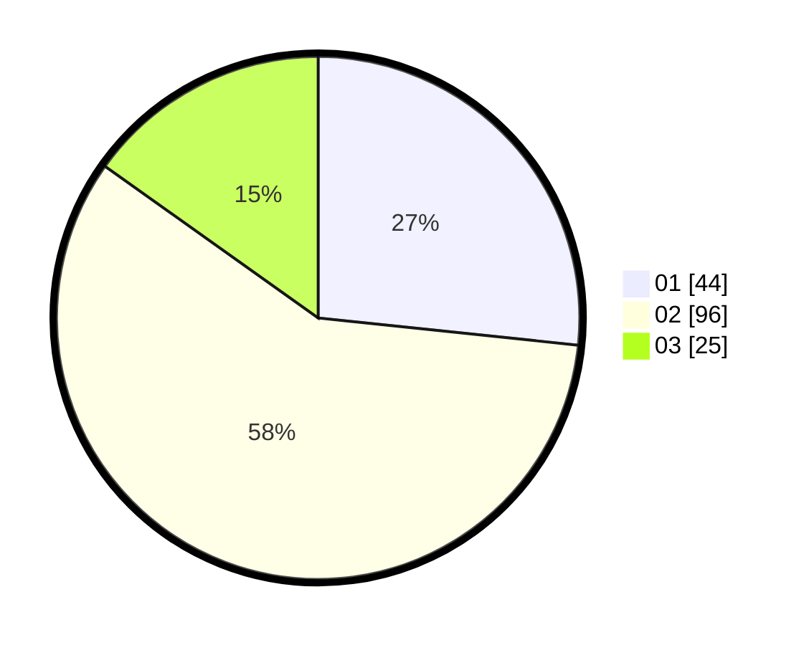

# Hasil

Hasil perolehan suara paslon dapat dilihat pada file paslon-01.txt, paslon-02.txt, dan paslon-03.txt.

Jika tidak ada, artinya data tersebut belum ada pada SIREKAP.

## Perolehan Suara

 * Paslon 01: **44**.
 * Paslon 02: **96**.
 * Paslon 03: **25**.

## Foto C Plano

https://sirekap-obj-formc.kpu.go.id/471f/pemilu/ppwp/31/75/03/10/02/3175031002081-20240214-235358--7ea2f990-b5c5-4eb7-a16d-ce53894f3bee.jpg

https://sirekap-obj-formc.kpu.go.id/471f/pemilu/ppwp/31/75/03/10/02/3175031002081-20240214-235440--a031e7ca-a125-438b-b42a-ae1c46b8013b.jpg

https://sirekap-obj-formc.kpu.go.id/471f/pemilu/ppwp/31/75/03/10/02/3175031002081-20240214-235513--1ddfb96b-ad06-4971-9549-43b0110298f2.jpg
