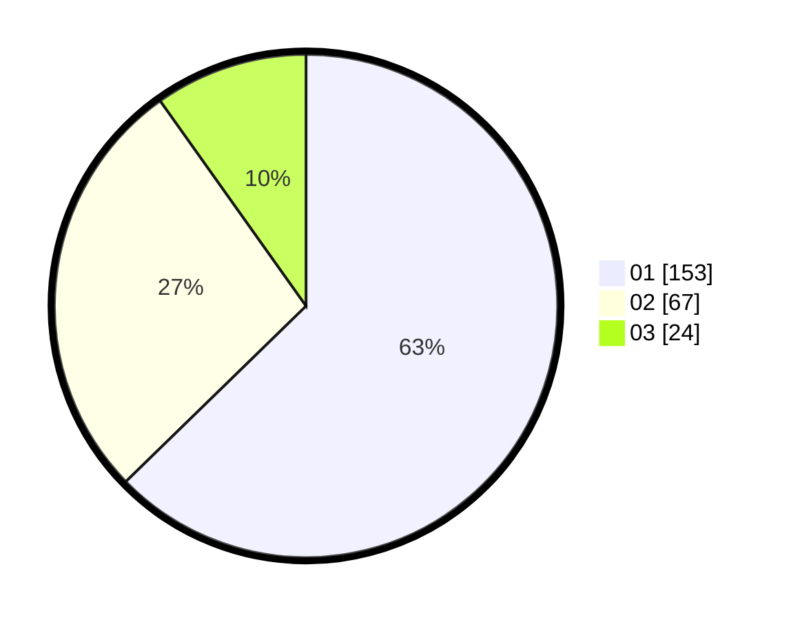

# Hasil

Hasil perolehan suara paslon dapat dilihat pada file paslon-01.txt, paslon-02.txt, dan paslon-03.txt.

Jika tidak ada, artinya data tersebut belum ada pada SIREKAP.

## Perolehan Suara

 * Paslon 01: **153**.
 * Paslon 02: **67**.
 * Paslon 03: **24**.

## Foto C Plano

https://sirekap-obj-formc.kpu.go.id/e3f8/pemilu/ppwp/31/75/03/10/02/3175031002082-20240215-011655--43f712d0-5ddd-493e-aa53-018f4176cd2e.jpg

https://sirekap-obj-formc.kpu.go.id/e3f8/pemilu/ppwp/31/75/03/10/02/3175031002082-20240215-011738--1eea68df-3368-4987-9897-80bd0ad77c92.jpg
