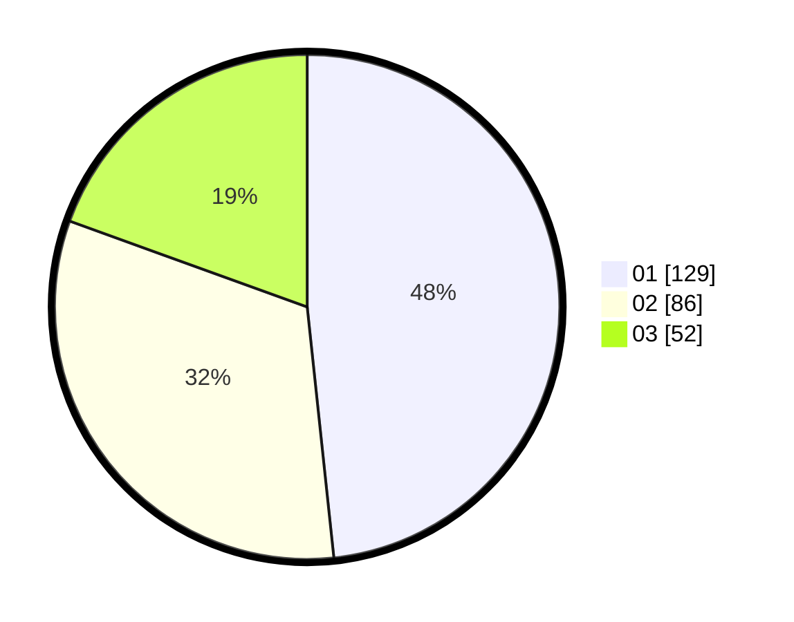

# Hasil

Hasil perolehan suara paslon dapat dilihat pada file paslon-01.txt, paslon-02.txt, dan paslon-03.txt.

Jika tidak ada, artinya data tersebut belum ada pada SIREKAP.

## Perolehan Suara

 * Paslon 01: **129**.
 * Paslon 02: **86**.
 * Paslon 03: **52**.

## Foto C Plano

https://sirekap-obj-formc.kpu.go.id/b580/pemilu/ppwp/31/75/03/10/02/3175031002083-20240216-151610--c0779cd2-90df-4f97-924f-030a935bbde1.jpg

https://sirekap-obj-formc.kpu.go.id/b580/pemilu/ppwp/31/75/03/10/02/3175031002083-20240216-151611--f7f1343c-03fb-4478-8a12-4dc813bbd870.jpg

https://sirekap-obj-formc.kpu.go.id/b580/pemilu/ppwp/31/75/03/10/02/3175031002083-20240216-151611--8265eaa3-b28c-4c32-afce-1b7b01c745e6.jpg

## DATA PEMILIH TETAP

Jumlah pemilih dalam DPT: **299**.
 * L: **142**.
 * P: **157**.

## DATA PENGGUNA HAK PILIH

Jumlah pengguna hak pilih dalam DPT: **243**.
 * L: **127**.
 * P: **116**.

Jumlah pengguna hak pilih dalam DPTb: **24**.
 * L: **14**.
 * P: **10**.

Jumlah pengguna hak pilih dalam DPK: **3**.
 * L: **2**.
 * P: **1**.

Jumlah pengguna hak pilih: **270**.
 * L: **143**.
 * P: **127**.

## JUMLAH SUARA SAH DAN TIDAK SAH

JUMLAH SELURUH SUARA SAH: **267**.

JUMLAH SUARA TIDAK SAH: **3**.

JUMLAH SELURUH SUARA SAH DAN SUARA TIDAK SAH: **270**.
