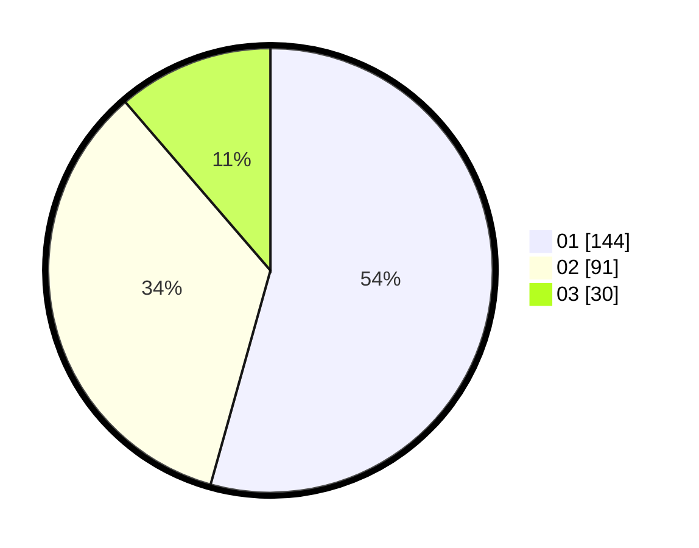

# Hasil

Hasil perolehan suara paslon dapat dilihat pada file paslon-01.txt, paslon-02.txt, dan paslon-03.txt.

Jika tidak ada, artinya data tersebut belum ada pada SIREKAP.

## Perolehan Suara

 * Paslon 01: **144**.
 * Paslon 02: **91**.
 * Paslon 03: **30**.

## Foto C Plano

https://sirekap-obj-formc.kpu.go.id/31e6/pemilu/ppwp/31/75/03/10/02/3175031002084-20240214-235337--d99ad30a-f577-4d17-a557-fdbd53c92158.jpg

https://sirekap-obj-formc.kpu.go.id/31e6/pemilu/ppwp/31/75/03/10/02/3175031002084-20240215-000403--e604c802-3e33-4eb0-bbe1-d1aed03b1585.jpg

https://sirekap-obj-formc.kpu.go.id/31e6/pemilu/ppwp/31/75/03/10/02/3175031002084-20240215-000503--01b7640b-3f5e-4e58-a0b7-8622f5cd4d89.jpg

## DATA PEMILIH TETAP

Jumlah pemilih dalam DPT: **295**.
 * L: **145**.
 * P: **150**.

## DATA PENGGUNA HAK PILIH

Jumlah pengguna hak pilih dalam DPT: **245**.
 * L: **116**.
 * P: **129**.

Jumlah pengguna hak pilih dalam DPTb: **23**.
 * L: **14**.
 * P: **9**.

Jumlah pengguna hak pilih dalam DPK: **0**.
 * L: **0**.
 * P: **0**.

Jumlah pengguna hak pilih: **268**.
 * L: **130**.
 * P: **138**.

## JUMLAH SUARA SAH DAN TIDAK SAH

JUMLAH SELURUH SUARA SAH: **265**.

JUMLAH SUARA TIDAK SAH: **3**.

JUMLAH SELURUH SUARA SAH DAN SUARA TIDAK SAH: **268**.
