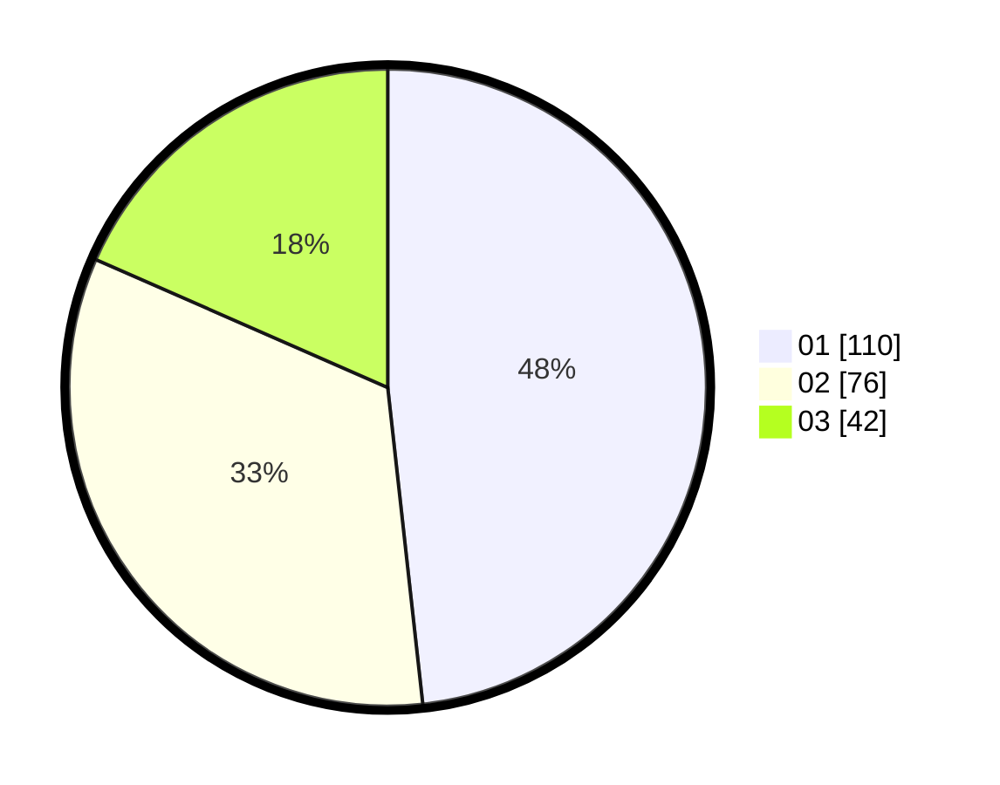

# Hasil

Hasil perolehan suara paslon dapat dilihat pada file paslon-01.txt, paslon-02.txt, dan paslon-03.txt.

Jika tidak ada, artinya data tersebut belum ada pada SIREKAP.

## Perolehan Suara

 * Paslon 01: **110**.
 * Paslon 02: **76**.
 * Paslon 03: **42**.

## Foto C Plano

https://sirekap-obj-formc.kpu.go.id/8b8c/pemilu/ppwp/31/75/03/10/02/3175031002088-20240215-141500--86c59a9c-7035-4313-855b-2ee0852f0eba.jpg

https://sirekap-obj-formc.kpu.go.id/8b8c/pemilu/ppwp/31/75/03/10/02/3175031002088-20240215-142111--3d252fd3-eac6-4adb-9b39-085096d8a672.jpg

https://sirekap-obj-formc.kpu.go.id/8b8c/pemilu/ppwp/31/75/03/10/02/3175031002088-20240215-165951--b273fb62-3bd8-4859-bc6e-d3a54082790f.jpg
