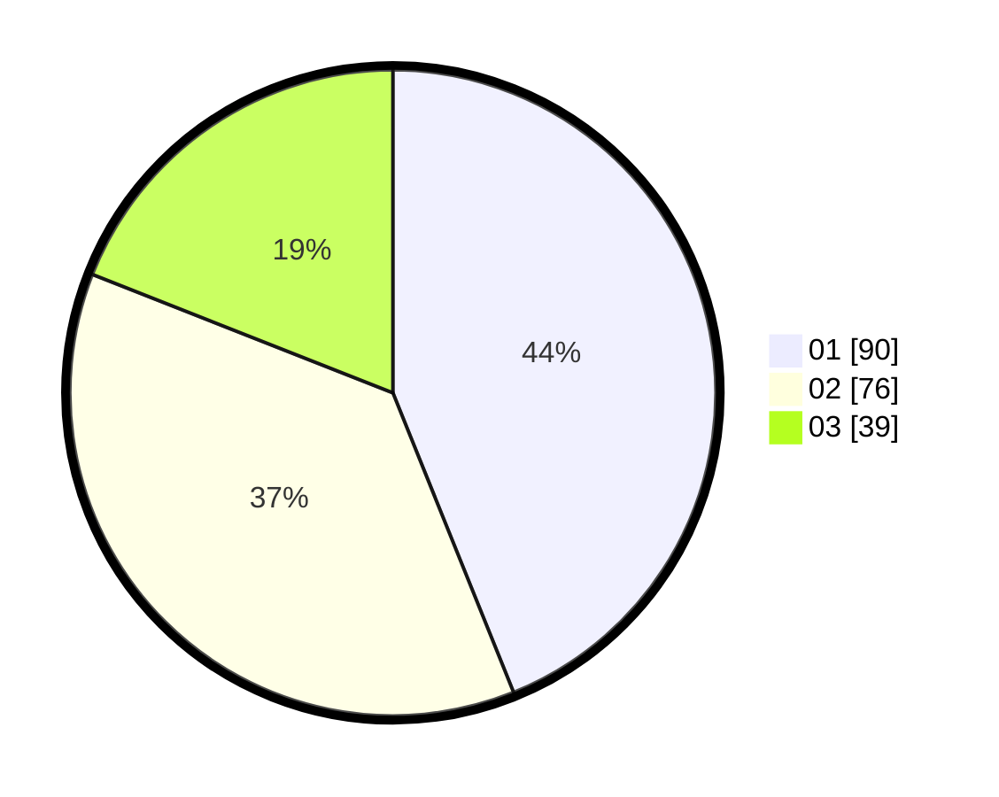

# Hasil

Hasil perolehan suara paslon dapat dilihat pada file paslon-01.txt, paslon-02.txt, dan paslon-03.txt.

Jika tidak ada, artinya data tersebut belum ada pada SIREKAP.

## Perolehan Suara

 * Paslon 01: **90**.
 * Paslon 02: **76**.
 * Paslon 03: **39**.

## Foto C Plano

https://sirekap-obj-formc.kpu.go.id/1e26/pemilu/ppwp/31/75/03/10/02/3175031002090-20240216-152507--22fa02a1-e8c6-408b-bf2e-8764d40ea3ca.jpg

https://sirekap-obj-formc.kpu.go.id/1e26/pemilu/ppwp/31/75/03/10/02/3175031002090-20240216-152509--2a1d29d0-1e6f-4c7c-aaa8-6026cc4173ab.jpg

https://sirekap-obj-formc.kpu.go.id/1e26/pemilu/ppwp/31/75/03/10/02/3175031002090-20240216-152508--ed0980c5-e69d-4e67-81d6-4d7d36a1bf34.jpg

## DATA PEMILIH TETAP

Jumlah pemilih dalam DPT: **276**.
 * L: **142**.
 * P: **134**.

## DATA PENGGUNA HAK PILIH

Jumlah pengguna hak pilih dalam DPT: **193**.
 * L: **94**.
 * P: **99**.

Jumlah pengguna hak pilih dalam DPTb: **9**.
 * L: **4**.
 * P: **5**.

Jumlah pengguna hak pilih dalam DPK: **4**.
 * L: **2**.
 * P: **2**.

Jumlah pengguna hak pilih: **206**.
 * L: **100**.
 * P: **106**.

## JUMLAH SUARA SAH DAN TIDAK SAH

JUMLAH SELURUH SUARA SAH: **206**.

JUMLAH SUARA TIDAK SAH: **0**.

JUMLAH SELURUH SUARA SAH DAN SUARA TIDAK SAH: **206**.
