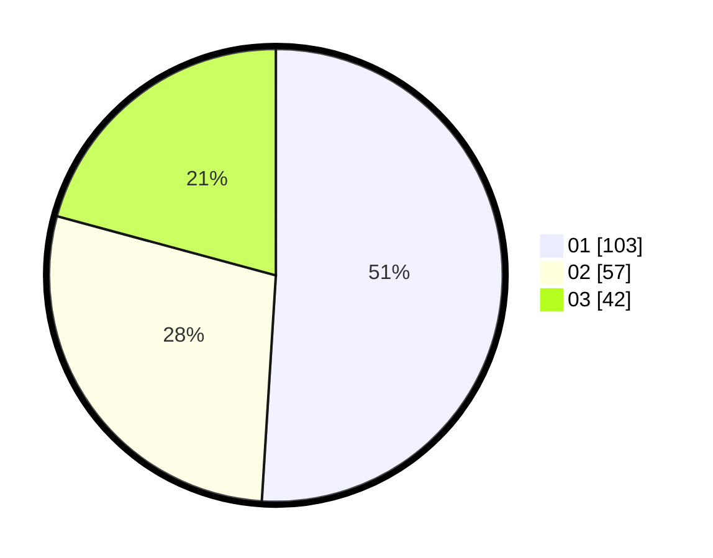

# Hasil

Hasil perolehan suara paslon dapat dilihat pada file paslon-01.txt, paslon-02.txt, dan paslon-03.txt.

Jika tidak ada, artinya data tersebut belum ada pada SIREKAP.

## Perolehan Suara

 * Paslon 01: **103**.
 * Paslon 02: **57**.
 * Paslon 03: **42**.

## Foto C Plano

https://sirekap-obj-formc.kpu.go.id/18a8/pemilu/ppwp/31/75/03/10/02/3175031002092-20240215-001519--2bfecf95-286d-4636-821d-18b8dd18bb6d.jpg

https://sirekap-obj-formc.kpu.go.id/18a8/pemilu/ppwp/31/75/03/10/02/3175031002092-20240215-001705--d732b4b4-309e-47f9-bddb-b1d784afa2e9.jpg
