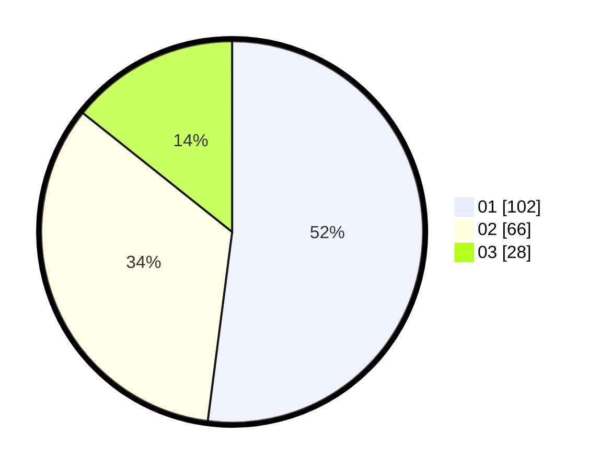

# Hasil

Hasil perolehan suara paslon dapat dilihat pada file paslon-01.txt, paslon-02.txt, dan paslon-03.txt.

Jika tidak ada, artinya data tersebut belum ada pada SIREKAP.

## Perolehan Suara

 * Paslon 01: **102**.
 * Paslon 02: **66**.
 * Paslon 03: **28**.

## Foto C Plano

https://sirekap-obj-formc.kpu.go.id/3389/pemilu/ppwp/31/75/03/10/02/3175031002094-20240214-193042--7bd37a8d-45a4-4ae9-ad3d-47417ed9356c.jpg

https://sirekap-obj-formc.kpu.go.id/3389/pemilu/ppwp/31/75/03/10/02/3175031002094-20240214-193051--dbb7d1be-0db5-4812-bdca-e8b06813bb30.jpg

https://sirekap-obj-formc.kpu.go.id/3389/pemilu/ppwp/31/75/03/10/02/3175031002094-20240214-193058--0fa70fbd-3a27-4979-80f7-9da6f75ba0cf.jpg

## DATA PEMILIH TETAP

Jumlah pemilih dalam DPT: **242**.
 * L: **120**.
 * P: **122**.

## DATA PENGGUNA HAK PILIH

Jumlah pengguna hak pilih dalam DPT: **186**.
 * L: **89**.
 * P: **97**.

Jumlah pengguna hak pilih dalam DPTb: **10**.
 * L: **8**.
 * P: **2**.

Jumlah pengguna hak pilih dalam DPK: **2**.
 * L: **0**.
 * P: **2**.

Jumlah pengguna hak pilih: **198**.
 * L: **97**.
 * P: **101**.

## JUMLAH SUARA SAH DAN TIDAK SAH

JUMLAH SELURUH SUARA SAH: **196**.

JUMLAH SUARA TIDAK SAH: **2**.

JUMLAH SELURUH SUARA SAH DAN SUARA TIDAK SAH: **198**.
