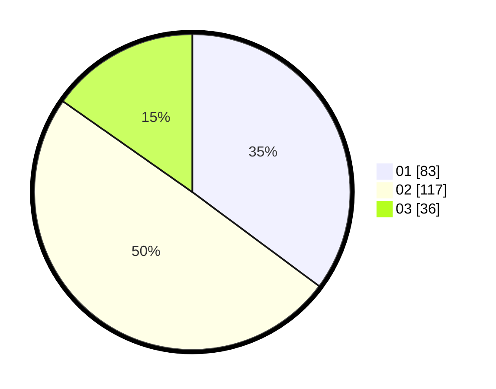

# Hasil

Hasil perolehan suara paslon dapat dilihat pada file paslon-01.txt, paslon-02.txt, dan paslon-03.txt.

Jika tidak ada, artinya data tersebut belum ada pada SIREKAP.

## Perolehan Suara

 * Paslon 01: **83**.
 * Paslon 02: **117**.
 * Paslon 03: **36**.

## Foto C Plano

https://sirekap-obj-formc.kpu.go.id/08e1/pemilu/ppwp/31/75/03/10/02/3175031002096-20240214-191531--7971535c-6541-4137-a33f-9ed9c445a16e.jpg

https://sirekap-obj-formc.kpu.go.id/08e1/pemilu/ppwp/31/75/03/10/02/3175031002096-20240214-191542--78283ea3-c095-4bd7-ade8-a4d0b88d2f65.jpg

https://sirekap-obj-formc.kpu.go.id/08e1/pemilu/ppwp/31/75/03/10/02/3175031002096-20240214-191547--434791bc-2ed0-4f52-8f5c-34236d2118c2.jpg
