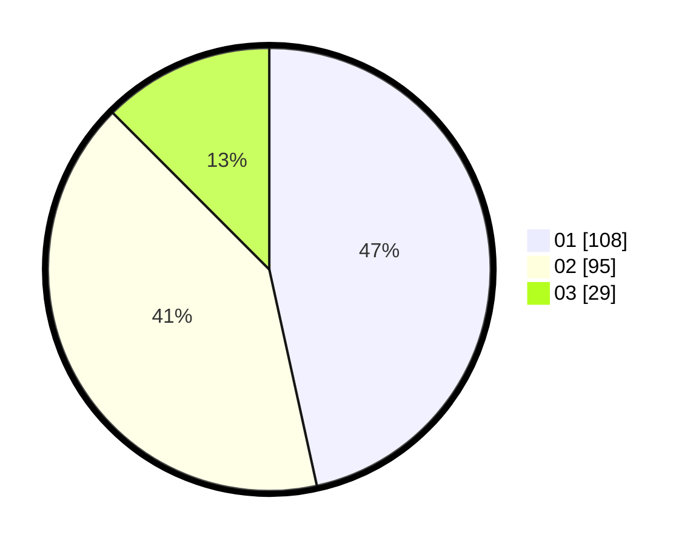

# Hasil

Hasil perolehan suara paslon dapat dilihat pada file paslon-01.txt, paslon-02.txt, dan paslon-03.txt.

Jika tidak ada, artinya data tersebut belum ada pada SIREKAP.

## Perolehan Suara

 * Paslon 01: **108**.
 * Paslon 02: **95**.
 * Paslon 03: **29**.

## Foto C Plano

https://sirekap-obj-formc.kpu.go.id/993a/pemilu/ppwp/31/75/03/10/02/3175031002099-20240215-003526--5a8d3524-260e-4c98-aaa3-4510ff577ce2.jpg

https://sirekap-obj-formc.kpu.go.id/993a/pemilu/ppwp/31/75/03/10/02/3175031002099-20240215-003743--ba95711f-7b9a-4154-b01a-af66f45084cd.jpg

https://sirekap-obj-formc.kpu.go.id/993a/pemilu/ppwp/31/75/03/10/02/3175031002099-20240215-003857--53b02e32-37c5-480f-a706-e64c46909192.jpg
