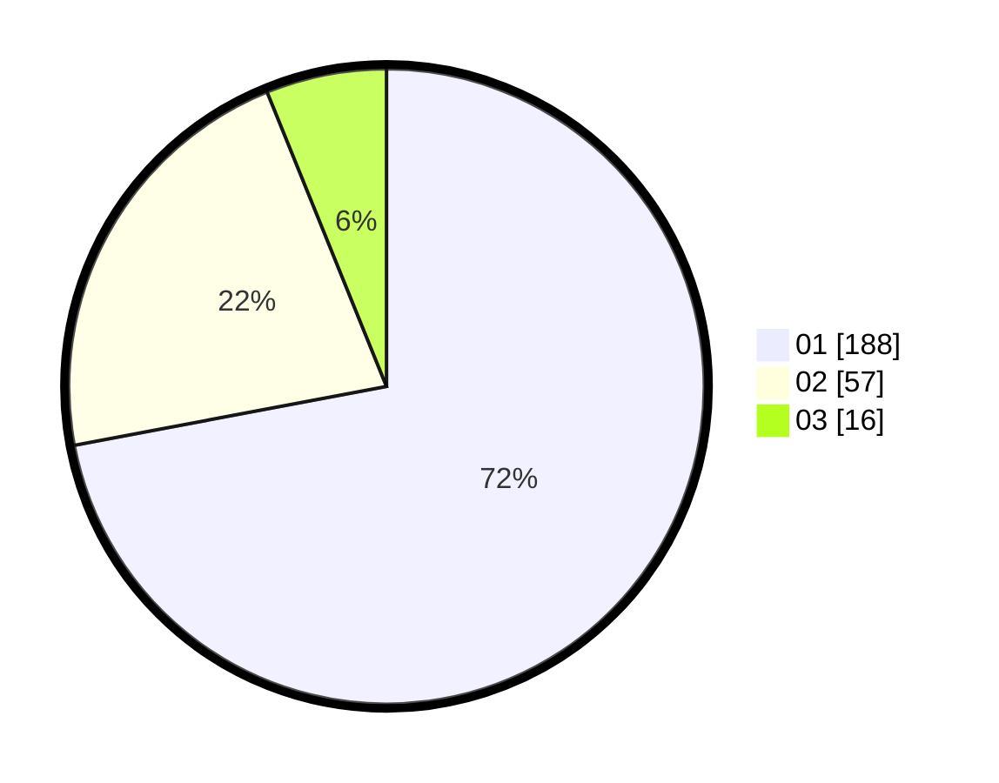

# Hasil

Hasil perolehan suara paslon dapat dilihat pada file paslon-01.txt, paslon-02.txt, dan paslon-03.txt.

Jika tidak ada, artinya data tersebut belum ada pada SIREKAP.

## Perolehan Suara

 * Paslon 01: **188**.
 * Paslon 02: **57**.
 * Paslon 03: **16**.

## Foto C Plano

https://sirekap-obj-formc.kpu.go.id/92c2/pemilu/ppwp/31/75/03/10/02/3175031002102-20240214-184600--98f4987b-65b0-4626-b096-1f9103ee4a12.jpg

https://sirekap-obj-formc.kpu.go.id/92c2/pemilu/ppwp/31/75/03/10/02/3175031002102-20240214-155322--7db27382-f277-4f3b-b4ae-108274e4fd32.jpg

https://sirekap-obj-formc.kpu.go.id/92c2/pemilu/ppwp/31/75/03/10/02/3175031002102-20240214-155521--796dd960-f045-4a22-9a35-da904f37b30d.jpg

## DATA PEMILIH TETAP

Jumlah pemilih dalam DPT: **295**.
 * L: **145**.
 * P: **150**.

## DATA PENGGUNA HAK PILIH

Jumlah pengguna hak pilih dalam DPT: **234**.
 * L: **113**.
 * P: **121**.

Jumlah pengguna hak pilih dalam DPTb: **21**.
 * L: **7**.
 * P: **14**.

Jumlah pengguna hak pilih dalam DPK: **7**.
 * L: **4**.
 * P: **3**.

Jumlah pengguna hak pilih: **262**.
 * L: **124**.
 * P: **138**.

## JUMLAH SUARA SAH DAN TIDAK SAH

JUMLAH SELURUH SUARA SAH: **261**.

JUMLAH SUARA TIDAK SAH: **1**.

JUMLAH SELURUH SUARA SAH DAN SUARA TIDAK SAH: **262**.
