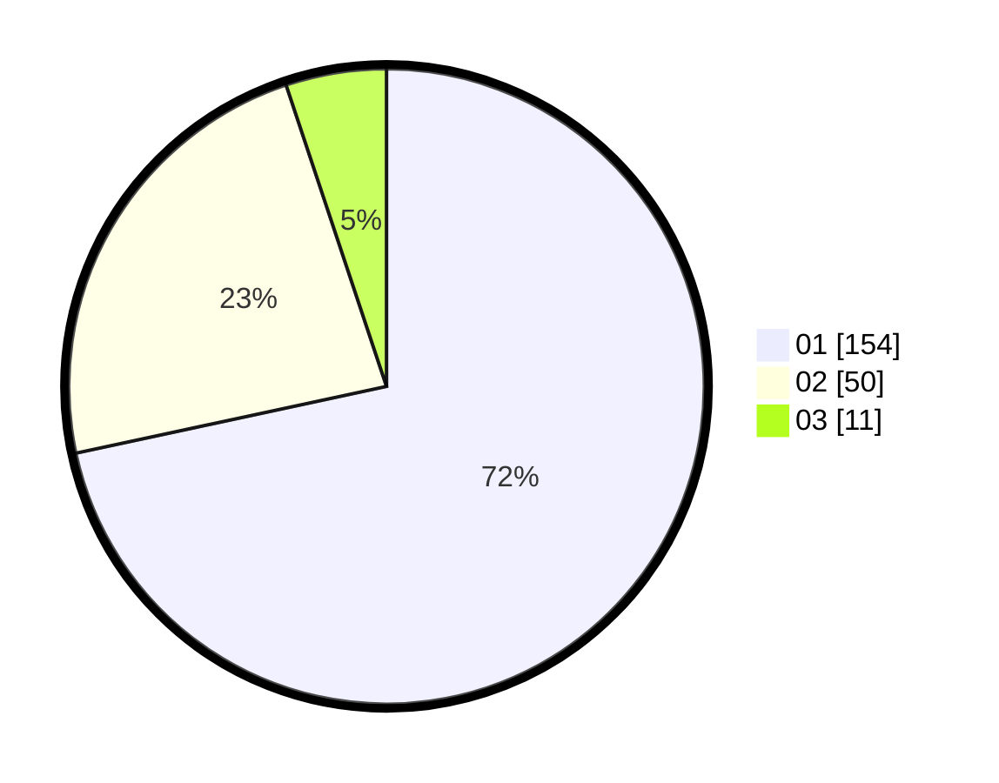

# Hasil

Hasil perolehan suara paslon dapat dilihat pada file paslon-01.txt, paslon-02.txt, dan paslon-03.txt.

Jika tidak ada, artinya data tersebut belum ada pada SIREKAP.

## Perolehan Suara

 * Paslon 01: **154**.
 * Paslon 02: **50**.
 * Paslon 03: **11**.

## Foto C Plano

https://sirekap-obj-formc.kpu.go.id/ef19/pemilu/ppwp/31/75/03/10/02/3175031002105-20240215-011640--dbfd5080-c66f-46df-868d-6327f520d045.jpg

https://sirekap-obj-formc.kpu.go.id/ef19/pemilu/ppwp/31/75/03/10/02/3175031002105-20240215-011810--df8cc860-747d-4037-b1f5-e3673e0bbec7.jpg

https://sirekap-obj-formc.kpu.go.id/ef19/pemilu/ppwp/31/75/03/10/02/3175031002105-20240215-012249--b897d520-51ee-4593-9379-e539c8d2ee6f.jpg
