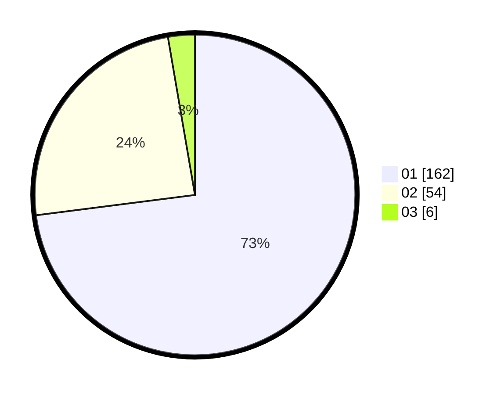

# Hasil

Hasil perolehan suara paslon dapat dilihat pada file paslon-01.txt, paslon-02.txt, dan paslon-03.txt.

Jika tidak ada, artinya data tersebut belum ada pada SIREKAP.

## Perolehan Suara

 * Paslon 01: **162**.
 * Paslon 02: **54**.
 * Paslon 03: **6**.

## Foto C Plano

https://sirekap-obj-formc.kpu.go.id/034e/pemilu/ppwp/31/75/03/10/02/3175031002106-20240214-191506--9cebd653-c37c-4d7f-a5de-879a7c4ad3f3.jpg

https://sirekap-obj-formc.kpu.go.id/034e/pemilu/ppwp/31/75/03/10/02/3175031002106-20240214-190418--b97fd092-eab7-40c3-ab2d-e5ed3bc71fde.jpg

https://sirekap-obj-formc.kpu.go.id/034e/pemilu/ppwp/31/75/03/10/02/3175031002106-20240214-190453--667f621f-06e9-4662-a4f0-032f9d3a0ba1.jpg

## DATA PEMILIH TETAP

Jumlah pemilih dalam DPT: **258**.
 * L: **114**.
 * P: **144**.

## DATA PENGGUNA HAK PILIH

Jumlah pengguna hak pilih dalam DPT: **208**.
 * L: **96**.
 * P: **112**.

Jumlah pengguna hak pilih dalam DPTb: **18**.
 * L: **2**.
 * P: **16**.

Jumlah pengguna hak pilih dalam DPK: **0**.
 * L: **0**.
 * P: **0**.

Jumlah pengguna hak pilih: **226**.
 * L: **98**.
 * P: **128**.

## JUMLAH SUARA SAH DAN TIDAK SAH

JUMLAH SELURUH SUARA SAH: **222**.

JUMLAH SUARA TIDAK SAH: **4**.

JUMLAH SELURUH SUARA SAH DAN SUARA TIDAK SAH: **226**.
