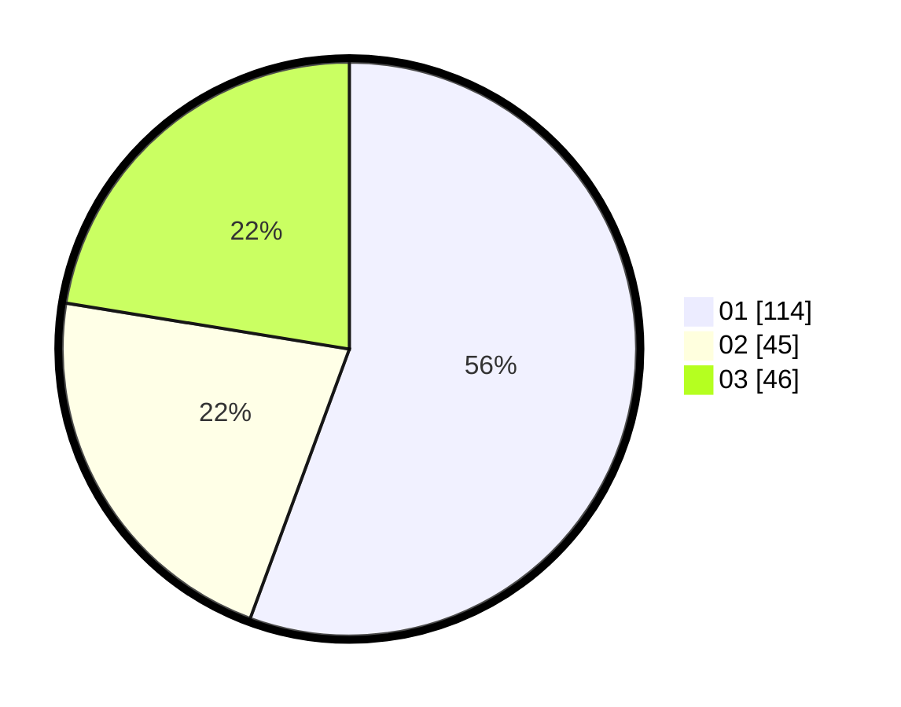

# Hasil

Hasil perolehan suara paslon dapat dilihat pada file paslon-01.txt, paslon-02.txt, dan paslon-03.txt.

Jika tidak ada, artinya data tersebut belum ada pada SIREKAP.

## Perolehan Suara

 * Paslon 01: **114**.
 * Paslon 02: **45**.
 * Paslon 03: **46**.

## Foto C Plano

https://sirekap-obj-formc.kpu.go.id/110d/pemilu/ppwp/31/75/03/10/02/3175031002109-20240214-230655--1a39a45a-2028-4f57-b1cd-69aafdc92548.jpg

https://sirekap-obj-formc.kpu.go.id/110d/pemilu/ppwp/31/75/03/10/02/3175031002109-20240214-230550--fefdb381-2237-4eec-a066-da1146bbe494.jpg

https://sirekap-obj-formc.kpu.go.id/110d/pemilu/ppwp/31/75/03/10/02/3175031002109-20240214-230754--f6aefcf2-8bde-48f4-af52-3c069a77c9a0.jpg
