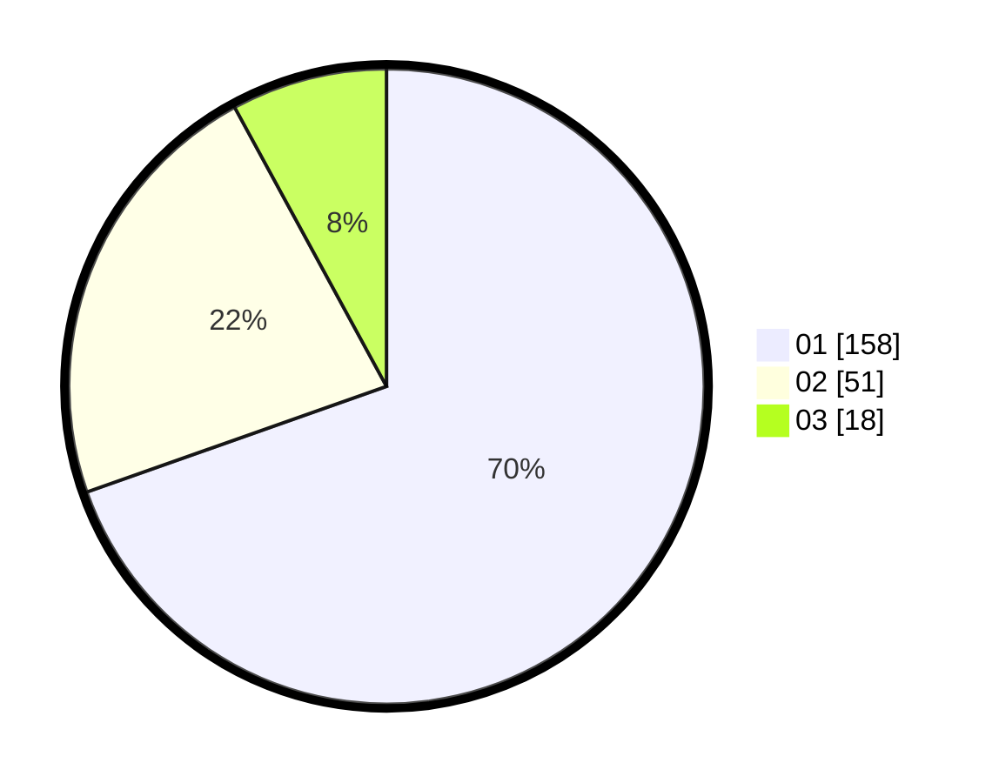

# Hasil

Hasil perolehan suara paslon dapat dilihat pada file paslon-01.txt, paslon-02.txt, dan paslon-03.txt.

Jika tidak ada, artinya data tersebut belum ada pada SIREKAP.

## Perolehan Suara

 * Paslon 01: **158**.
 * Paslon 02: **51**.
 * Paslon 03: **18**.

## Foto C Plano

https://sirekap-obj-formc.kpu.go.id/bf29/pemilu/ppwp/31/75/03/10/02/3175031002111-20240214-202924--7994e19f-583f-452a-bce3-fce1cdebf04d.jpg

https://sirekap-obj-formc.kpu.go.id/bf29/pemilu/ppwp/31/75/03/10/02/3175031002111-20240214-193301--b4debf54-c618-4ba6-a093-be67a03e2530.jpg

https://sirekap-obj-formc.kpu.go.id/bf29/pemilu/ppwp/31/75/03/10/02/3175031002111-20240214-200524--1f393d93-0da2-418f-afd7-757f4e07311e.jpg

## DATA PEMILIH TETAP

Jumlah pemilih dalam DPT: **258**.
 * L: **127**.
 * P: **131**.

## DATA PENGGUNA HAK PILIH

Jumlah pengguna hak pilih dalam DPT: **213**.
 * L: **106**.
 * P: **107**.

Jumlah pengguna hak pilih dalam DPTb: **15**.
 * L: **2**.
 * P: **13**.

Jumlah pengguna hak pilih dalam DPK: **2**.
 * L: **0**.
 * P: **2**.

Jumlah pengguna hak pilih: **230**.
 * L: **108**.
 * P: **122**.

## JUMLAH SUARA SAH DAN TIDAK SAH

JUMLAH SELURUH SUARA SAH: **227**.

JUMLAH SUARA TIDAK SAH: **3**.

JUMLAH SELURUH SUARA SAH DAN SUARA TIDAK SAH: **230**.
