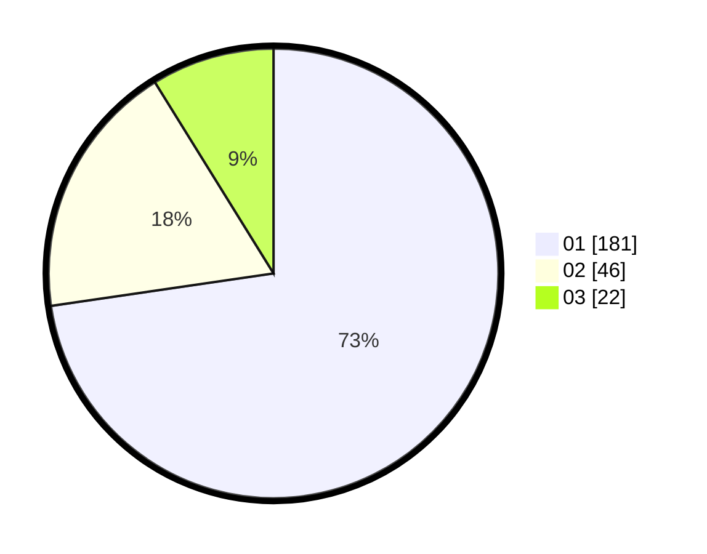

# Hasil

Hasil perolehan suara paslon dapat dilihat pada file paslon-01.txt, paslon-02.txt, dan paslon-03.txt.

Jika tidak ada, artinya data tersebut belum ada pada SIREKAP.

## Perolehan Suara

 * Paslon 01: **181**.
 * Paslon 02: **46**.
 * Paslon 03: **22**.

## Foto C Plano

https://sirekap-obj-formc.kpu.go.id/97aa/pemilu/ppwp/31/75/03/10/02/3175031002113-20240214-232210--0460d028-5475-426f-9ac2-96d10d00a4c9.jpg

https://sirekap-obj-formc.kpu.go.id/97aa/pemilu/ppwp/31/75/03/10/02/3175031002113-20240214-231225--a57a9b14-3df2-4d47-be3e-5df1eb9fbf3f.jpg
