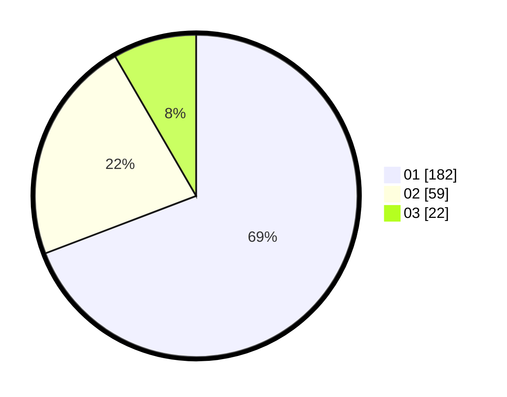

# Hasil

Hasil perolehan suara paslon dapat dilihat pada file paslon-01.txt, paslon-02.txt, dan paslon-03.txt.

Jika tidak ada, artinya data tersebut belum ada pada SIREKAP.

## Perolehan Suara

 * Paslon 01: **182**.
 * Paslon 02: **59**.
 * Paslon 03: **22**.

## Foto C Plano

https://sirekap-obj-formc.kpu.go.id/23b0/pemilu/ppwp/31/75/03/10/02/3175031002115-20240215-021119--2b9f45d9-593d-486a-ace0-93b8bced3083.jpg

https://sirekap-obj-formc.kpu.go.id/23b0/pemilu/ppwp/31/75/03/10/02/3175031002115-20240215-021240--333bcc12-1f1b-42e0-a507-d1c00f691e63.jpg

https://sirekap-obj-formc.kpu.go.id/23b0/pemilu/ppwp/31/75/03/10/02/3175031002115-20240214-230158--290a1a45-d749-435a-a8a6-9cd6463b4326.jpg
