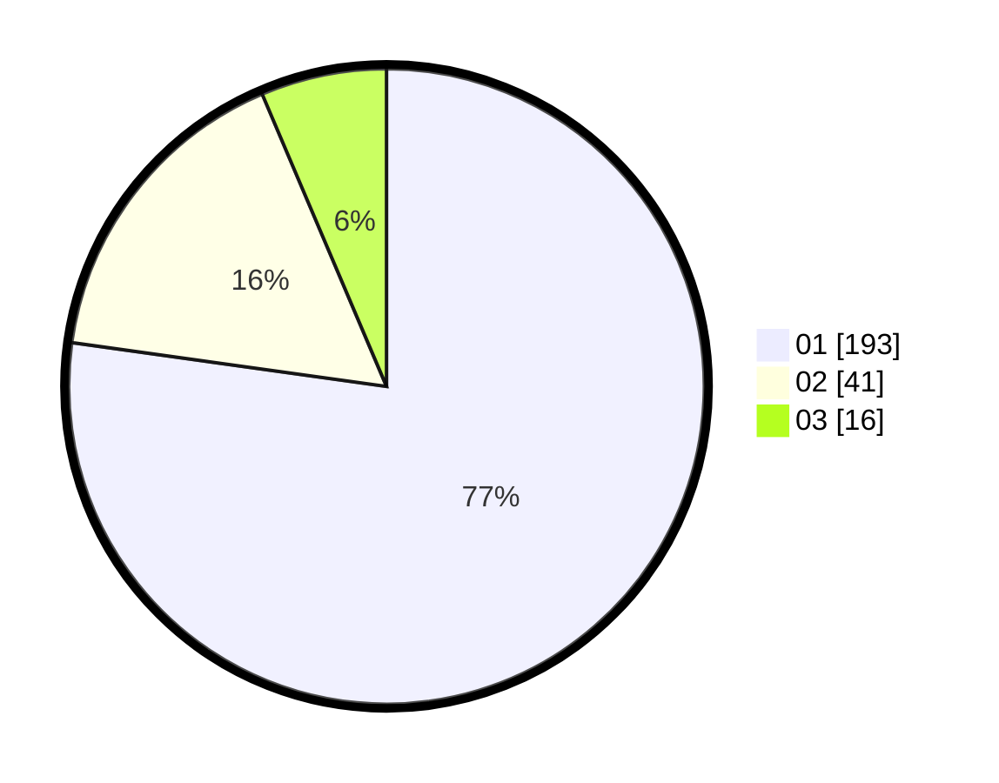

# Hasil

Hasil perolehan suara paslon dapat dilihat pada file paslon-01.txt, paslon-02.txt, dan paslon-03.txt.

Jika tidak ada, artinya data tersebut belum ada pada SIREKAP.

## Perolehan Suara

 * Paslon 01: **193**.
 * Paslon 02: **41**.
 * Paslon 03: **16**.

## Foto C Plano

https://sirekap-obj-formc.kpu.go.id/eef0/pemilu/ppwp/31/75/03/10/02/3175031002117-20240215-004910--7ede0b25-9ed0-4a91-af5a-bdeec4331641.jpg

https://sirekap-obj-formc.kpu.go.id/eef0/pemilu/ppwp/31/75/03/10/02/3175031002117-20240215-005110--5999981a-9715-4955-a368-18b0473f024d.jpg

https://sirekap-obj-formc.kpu.go.id/eef0/pemilu/ppwp/31/75/03/10/02/3175031002117-20240215-005244--7277896e-6781-4fe1-89b9-7720f449b97c.jpg
