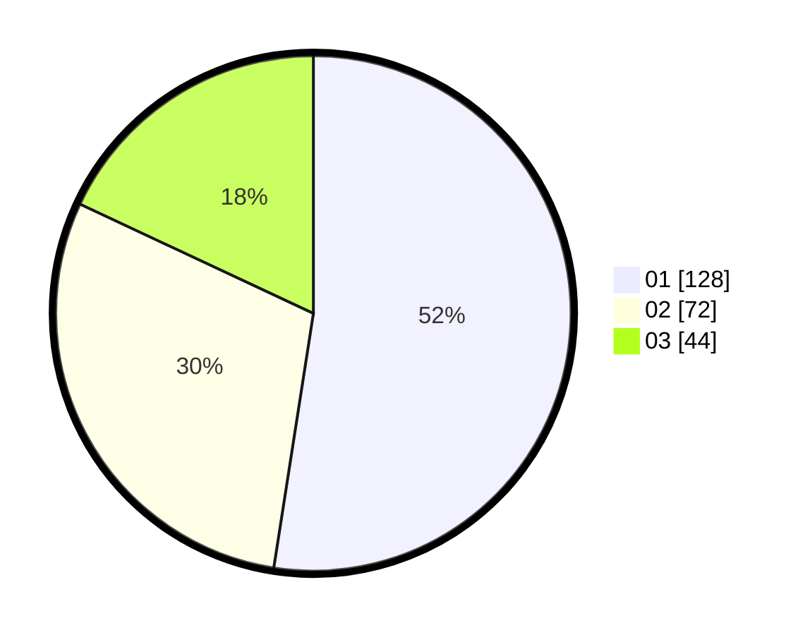

# Hasil

Hasil perolehan suara paslon dapat dilihat pada file paslon-01.txt, paslon-02.txt, dan paslon-03.txt.

Jika tidak ada, artinya data tersebut belum ada pada SIREKAP.

## Perolehan Suara

 * Paslon 01: **128**.
 * Paslon 02: **72**.
 * Paslon 03: **44**.

## Foto C Plano

https://sirekap-obj-formc.kpu.go.id/9ecf/pemilu/ppwp/31/75/03/10/02/3175031002119-20240215-004823--00e30350-65ce-4ec3-9c6b-43dc32d6bd45.jpg

https://sirekap-obj-formc.kpu.go.id/9ecf/pemilu/ppwp/31/75/03/10/02/3175031002119-20240215-004849--18fdf106-89be-40aa-91cf-2fabd03c4074.jpg

https://sirekap-obj-formc.kpu.go.id/9ecf/pemilu/ppwp/31/75/03/10/02/3175031002119-20240215-004914--31905b9a-26c3-4007-b11c-3cdd3979f5e3.jpg
