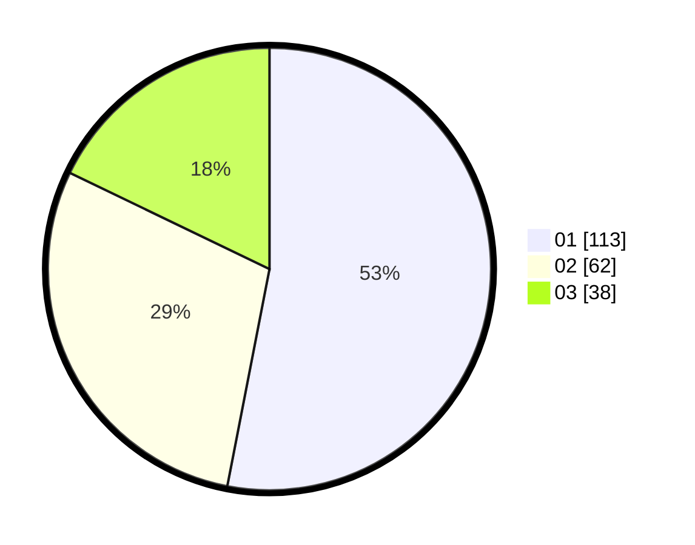

# Hasil

Hasil perolehan suara paslon dapat dilihat pada file paslon-01.txt, paslon-02.txt, dan paslon-03.txt.

Jika tidak ada, artinya data tersebut belum ada pada SIREKAP.

## Perolehan Suara

 * Paslon 01: **113**.
 * Paslon 02: **62**.
 * Paslon 03: **38**.

## Foto C Plano

https://sirekap-obj-formc.kpu.go.id/6f03/pemilu/ppwp/31/75/03/10/03/3175031003005-20240214-164927--5c684951-ad24-49d7-8a5f-7d8020c2d195.jpg

https://sirekap-obj-formc.kpu.go.id/6f03/pemilu/ppwp/31/75/03/10/03/3175031003005-20240214-164928--034f4003-b760-4b83-8f49-d0f97f3dd7ba.jpg

https://sirekap-obj-formc.kpu.go.id/6f03/pemilu/ppwp/31/75/03/10/03/3175031003005-20240214-164927--cc0c6357-cba2-48f4-9c78-020d45a5319c.jpg

## DATA PEMILIH TETAP

Jumlah pemilih dalam DPT: **269**.
 * L: **127**.
 * P: **142**.

## DATA PENGGUNA HAK PILIH

Jumlah pengguna hak pilih dalam DPT: **201**.
 * L: **90**.
 * P: **111**.

Jumlah pengguna hak pilih dalam DPTb: **2**.
 * L: **1**.
 * P: **1**.

Jumlah pengguna hak pilih dalam DPK: **3**.
 * L: **1**.
 * P: **2**.

Jumlah pengguna hak pilih: **206**.
 * L: **92**.
 * P: **114**.

## JUMLAH SUARA SAH DAN TIDAK SAH

JUMLAH SELURUH SUARA SAH: **213**.

JUMLAH SUARA TIDAK SAH: **3**.

JUMLAH SELURUH SUARA SAH DAN SUARA TIDAK SAH: **216**.
