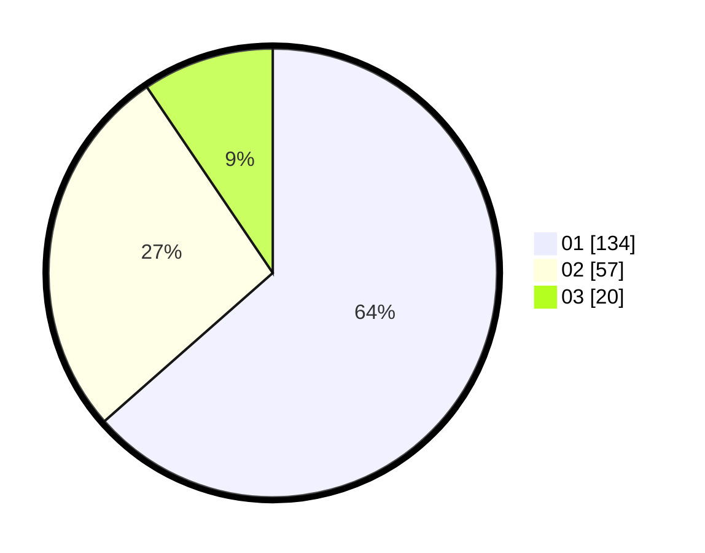

# Hasil

Hasil perolehan suara paslon dapat dilihat pada file paslon-01.txt, paslon-02.txt, dan paslon-03.txt.

Jika tidak ada, artinya data tersebut belum ada pada SIREKAP.

## Perolehan Suara

 * Paslon 01: **134**.
 * Paslon 02: **57**.
 * Paslon 03: **20**.

## Foto C Plano

https://sirekap-obj-formc.kpu.go.id/2ed0/pemilu/ppwp/31/75/03/10/03/3175031003007-20240215-234127--48470201-697a-4a13-bbe1-da2b1a6a160b.jpg

https://sirekap-obj-formc.kpu.go.id/2ed0/pemilu/ppwp/31/75/03/10/03/3175031003007-20240215-234130--533286f4-92ba-4421-a3e3-bdda845b61e2.jpg

https://sirekap-obj-formc.kpu.go.id/2ed0/pemilu/ppwp/31/75/03/10/03/3175031003007-20240215-234128--4975127f-67a6-4fdb-84a4-74e7b24b038e.jpg

## DATA PEMILIH TETAP

Jumlah pemilih dalam DPT: **267**.
 * L: **139**.
 * P: **128**.

## DATA PENGGUNA HAK PILIH

Jumlah pengguna hak pilih dalam DPT: **209**.
 * L: **107**.
 * P: **102**.

Jumlah pengguna hak pilih dalam DPTb: **0**.
 * L: **0**.
 * P: **0**.

Jumlah pengguna hak pilih dalam DPK: **4**.
 * L: **3**.
 * P: **1**.

Jumlah pengguna hak pilih: **213**.
 * L: **110**.
 * P: **103**.

## JUMLAH SUARA SAH DAN TIDAK SAH

JUMLAH SELURUH SUARA SAH: **211**.

JUMLAH SUARA TIDAK SAH: **2**.

JUMLAH SELURUH SUARA SAH DAN SUARA TIDAK SAH: **213**.
