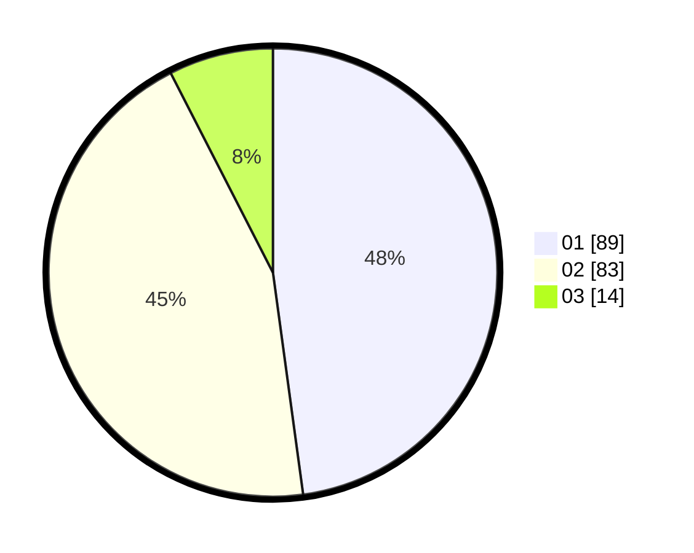

# Hasil

Hasil perolehan suara paslon dapat dilihat pada file paslon-01.txt, paslon-02.txt, dan paslon-03.txt.

Jika tidak ada, artinya data tersebut belum ada pada SIREKAP.

## Perolehan Suara

 * Paslon 01: **89**.
 * Paslon 02: **83**.
 * Paslon 03: **14**.

## Foto C Plano

https://sirekap-obj-formc.kpu.go.id/3c3e/pemilu/ppwp/31/75/03/10/03/3175031003008-20240216-002752--0616a69e-0a00-4ae0-966b-3900608173ac.jpg

https://sirekap-obj-formc.kpu.go.id/3c3e/pemilu/ppwp/31/75/03/10/03/3175031003008-20240216-002755--afd1dec3-0d71-4909-b9b1-571b141fbf60.jpg

https://sirekap-obj-formc.kpu.go.id/3c3e/pemilu/ppwp/31/75/03/10/03/3175031003008-20240216-002754--809b809a-6faa-41b0-8e09-0eb2acba2c6c.jpg

## DATA PEMILIH TETAP

Jumlah pemilih dalam DPT: **277**.
 * L: **146**.
 * P: **131**.

## DATA PENGGUNA HAK PILIH

Jumlah pengguna hak pilih dalam DPT: **183**.
 * L: **92**.
 * P: **91**.

Jumlah pengguna hak pilih dalam DPTb: **3**.
 * L: **1**.
 * P: **2**.

Jumlah pengguna hak pilih dalam DPK: **0**.
 * L: **0**.
 * P: **0**.

Jumlah pengguna hak pilih: **186**.
 * L: **93**.
 * P: **93**.

## JUMLAH SUARA SAH DAN TIDAK SAH

JUMLAH SELURUH SUARA SAH: **186**.

JUMLAH SUARA TIDAK SAH: **0**.

JUMLAH SELURUH SUARA SAH DAN SUARA TIDAK SAH: **186**.
