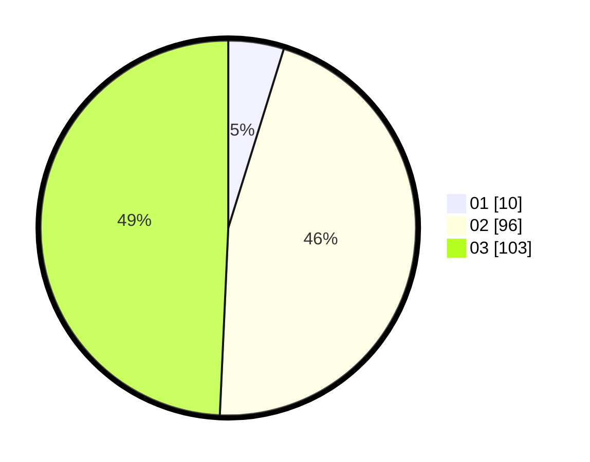

# Hasil

Hasil perolehan suara paslon dapat dilihat pada file paslon-01.txt, paslon-02.txt, dan paslon-03.txt.

Jika tidak ada, artinya data tersebut belum ada pada SIREKAP.

## Perolehan Suara

 * Paslon 01: **10**.
 * Paslon 02: **96**.
 * Paslon 03: **103**.

## Foto C Plano

https://sirekap-obj-formc.kpu.go.id/84fa/pemilu/ppwp/31/75/03/10/03/3175031003016-20240215-210556--e8717bbb-314d-40ed-99f4-4c08b8fdcdd4.jpg

https://sirekap-obj-formc.kpu.go.id/84fa/pemilu/ppwp/31/75/03/10/03/3175031003016-20240215-210600--ad8dbf6d-7ce1-46b0-8dd2-d3e7585b933b.jpg

https://sirekap-obj-formc.kpu.go.id/84fa/pemilu/ppwp/31/75/03/10/03/3175031003016-20240215-210557--1e81c5c0-e61f-4eb2-8418-02685e79a18c.jpg

## DATA PEMILIH TETAP

Jumlah pemilih dalam DPT: **288**.
 * L: **132**.
 * P: **156**.

## DATA PENGGUNA HAK PILIH

Jumlah pengguna hak pilih dalam DPT: **197**.
 * L: **90**.
 * P: **107**.

Jumlah pengguna hak pilih dalam DPTb: **11**.
 * L: **3**.
 * P: **8**.

Jumlah pengguna hak pilih dalam DPK: **3**.
 * L: **1**.
 * P: **2**.

Jumlah pengguna hak pilih: **211**.
 * L: **94**.
 * P: **117**.

## JUMLAH SUARA SAH DAN TIDAK SAH

JUMLAH SELURUH SUARA SAH: **209**.

JUMLAH SUARA TIDAK SAH: **2**.

JUMLAH SELURUH SUARA SAH DAN SUARA TIDAK SAH: **211**.
