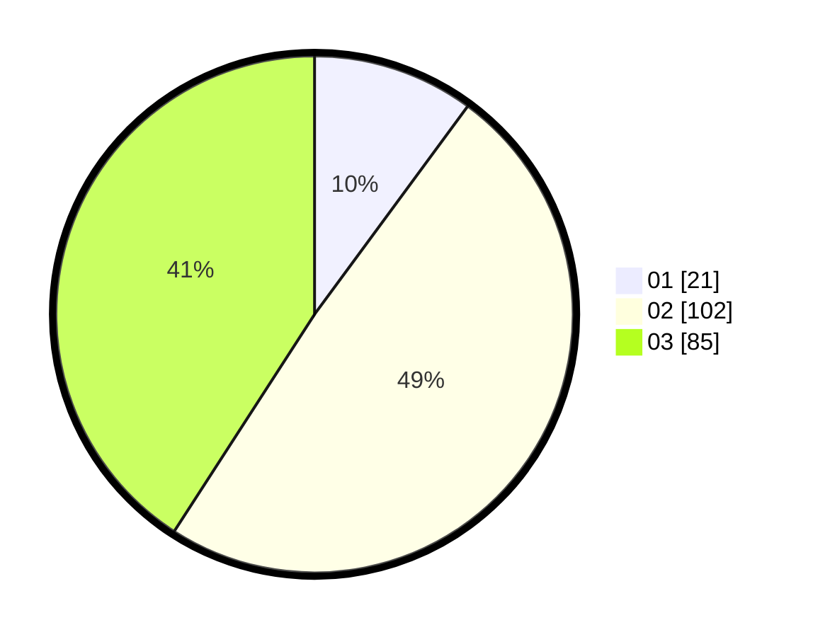

# Hasil

Hasil perolehan suara paslon dapat dilihat pada file paslon-01.txt, paslon-02.txt, dan paslon-03.txt.

Jika tidak ada, artinya data tersebut belum ada pada SIREKAP.

## Perolehan Suara

 * Paslon 01: **21**.
 * Paslon 02: **102**.
 * Paslon 03: **85**.

## Foto C Plano

https://sirekap-obj-formc.kpu.go.id/d4be/pemilu/ppwp/31/75/03/10/03/3175031003020-20240214-235857--e86581ab-f653-44f3-95ad-2a600cd2b88d.jpg

https://sirekap-obj-formc.kpu.go.id/d4be/pemilu/ppwp/31/75/03/10/03/3175031003020-20240215-000222--8e2e462d-838c-4a7d-99f9-98c5e54bcb44.jpg

https://sirekap-obj-formc.kpu.go.id/d4be/pemilu/ppwp/31/75/03/10/03/3175031003020-20240215-000318--dd9db8df-0cfe-41ed-9583-528d8d409041.jpg
