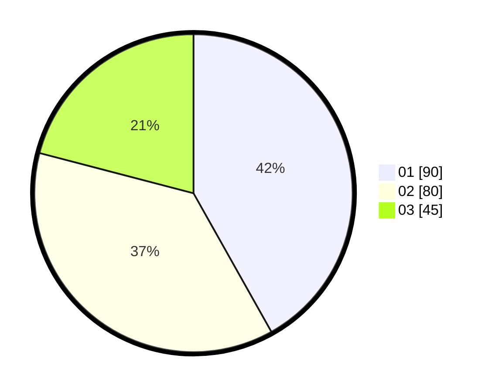

# Hasil

Hasil perolehan suara paslon dapat dilihat pada file paslon-01.txt, paslon-02.txt, dan paslon-03.txt.

Jika tidak ada, artinya data tersebut belum ada pada SIREKAP.

## Perolehan Suara

 * Paslon 01: **90**.
 * Paslon 02: **80**.
 * Paslon 03: **45**.

## Foto C Plano

https://sirekap-obj-formc.kpu.go.id/8233/pemilu/ppwp/31/75/03/10/03/3175031003024-20240214-234342--4fe5306f-9c5d-4604-9064-5ea58727d908.jpg

https://sirekap-obj-formc.kpu.go.id/8233/pemilu/ppwp/31/75/03/10/03/3175031003024-20240214-234437--d9e8c745-e116-41c4-ba53-406eb3a60954.jpg

https://sirekap-obj-formc.kpu.go.id/8233/pemilu/ppwp/31/75/03/10/03/3175031003024-20240214-234528--a0ca5d24-8411-452f-b790-c5355de41cf2.jpg
