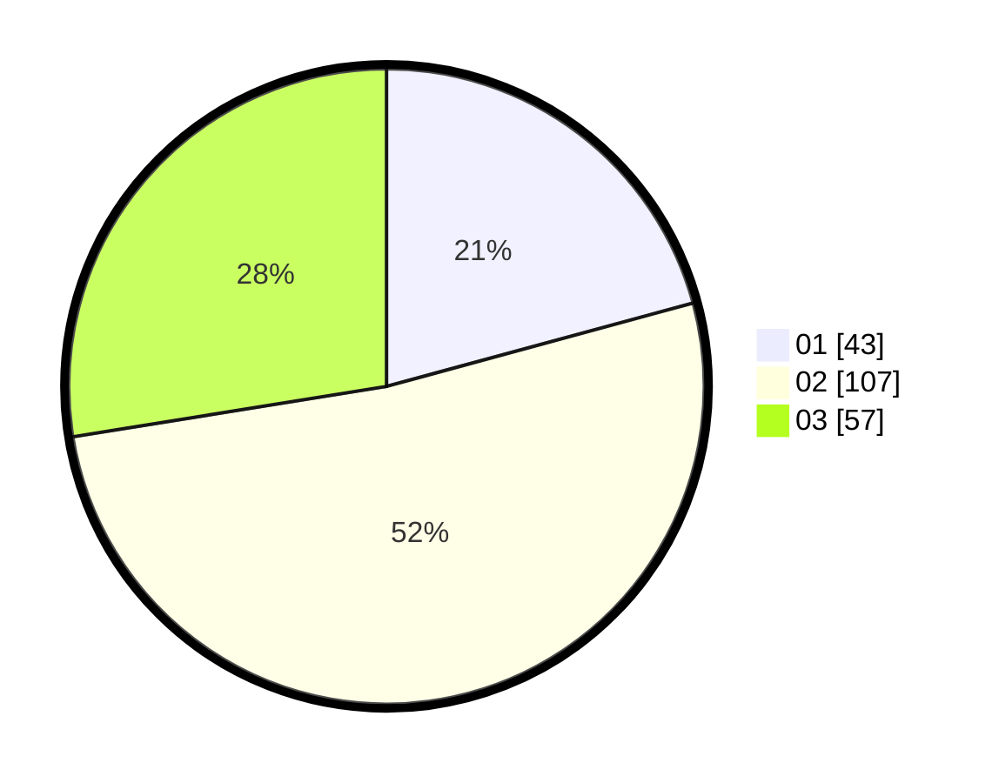

# Hasil

Hasil perolehan suara paslon dapat dilihat pada file paslon-01.txt, paslon-02.txt, dan paslon-03.txt.

Jika tidak ada, artinya data tersebut belum ada pada SIREKAP.

## Perolehan Suara

 * Paslon 01: **43**.
 * Paslon 02: **107**.
 * Paslon 03: **57**.

## Foto C Plano

https://sirekap-obj-formc.kpu.go.id/546d/pemilu/ppwp/31/75/03/10/03/3175031003026-20240214-233443--bbecbf0b-f75e-4607-831e-32d997ffb711.jpg

https://sirekap-obj-formc.kpu.go.id/546d/pemilu/ppwp/31/75/03/10/03/3175031003026-20240214-235153--9e396cbf-cd22-4ce1-babb-26342e910d38.jpg

https://sirekap-obj-formc.kpu.go.id/546d/pemilu/ppwp/31/75/03/10/03/3175031003026-20240214-235229--ac0712d3-b0cc-4aa2-9215-f1c27db96e17.jpg
