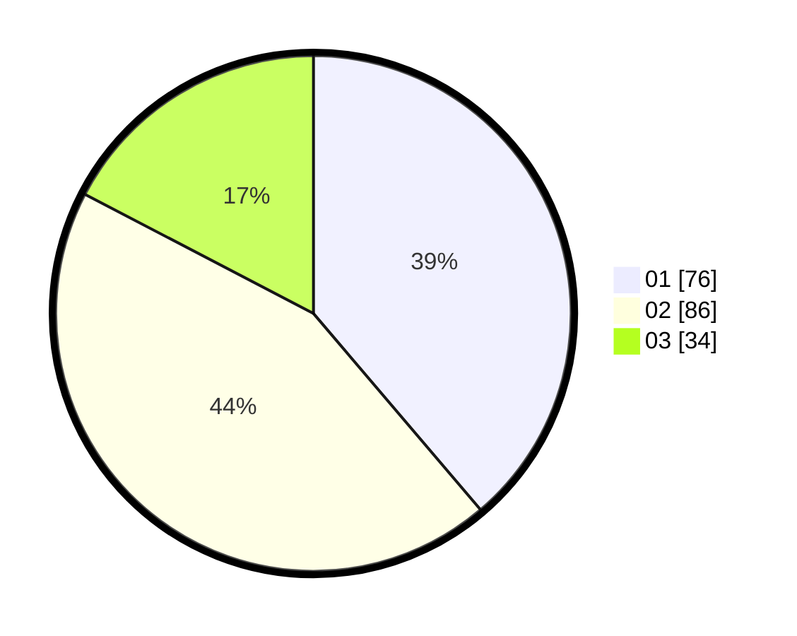

# Hasil

Hasil perolehan suara paslon dapat dilihat pada file paslon-01.txt, paslon-02.txt, dan paslon-03.txt.

Jika tidak ada, artinya data tersebut belum ada pada SIREKAP.

## Perolehan Suara

 * Paslon 01: **76**.
 * Paslon 02: **86**.
 * Paslon 03: **34**.

## Foto C Plano

https://sirekap-obj-formc.kpu.go.id/a08f/pemilu/ppwp/31/75/03/10/03/3175031003027-20240216-054419--4552fc78-33c7-4667-aca4-d4459014a9b0.jpg

https://sirekap-obj-formc.kpu.go.id/a08f/pemilu/ppwp/31/75/03/10/03/3175031003027-20240216-060743--11d6a86e-b56f-4c00-8fe4-7ebbc051a263.jpg

https://sirekap-obj-formc.kpu.go.id/a08f/pemilu/ppwp/31/75/03/10/03/3175031003027-20240216-054423--ec885382-1b9d-4505-88e3-a47ad5ca9b4c.jpg

## DATA PEMILIH TETAP

Jumlah pemilih dalam DPT: **0**.
 * L: **0**.
 * P: **0**.

## DATA PENGGUNA HAK PILIH

Jumlah pengguna hak pilih dalam DPT: **0**.
 * L: **0**.
 * P: **0**.

Jumlah pengguna hak pilih dalam DPTb: **0**.
 * L: **0**.
 * P: **0**.

Jumlah pengguna hak pilih dalam DPK: **0**.
 * L: **0**.
 * P: **0**.

Jumlah pengguna hak pilih: **0**.
 * L: **0**.
 * P: **0**.

## JUMLAH SUARA SAH DAN TIDAK SAH

JUMLAH SELURUH SUARA SAH: **196**.

JUMLAH SUARA TIDAK SAH: **6**.

JUMLAH SELURUH SUARA SAH DAN SUARA TIDAK SAH: **202**.
