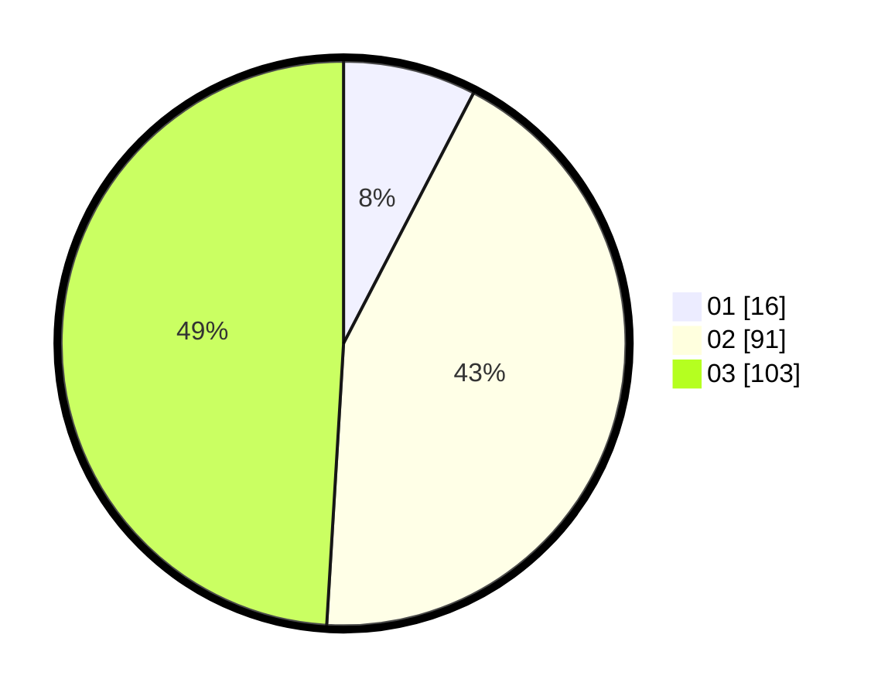

# Hasil

Hasil perolehan suara paslon dapat dilihat pada file paslon-01.txt, paslon-02.txt, dan paslon-03.txt.

Jika tidak ada, artinya data tersebut belum ada pada SIREKAP.

## Perolehan Suara

 * Paslon 01: **16**.
 * Paslon 02: **91**.
 * Paslon 03: **103**.

## Foto C Plano

https://sirekap-obj-formc.kpu.go.id/e7b6/pemilu/ppwp/31/75/03/10/03/3175031003028-20240214-230916--15b0b5cc-9b7c-49c7-b806-0b2322b3b0cb.jpg

https://sirekap-obj-formc.kpu.go.id/e7b6/pemilu/ppwp/31/75/03/10/03/3175031003028-20240214-231504--fc5c62af-213d-4551-b30f-a9c9b7023539.jpg
